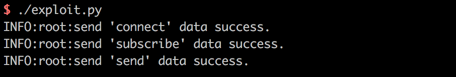
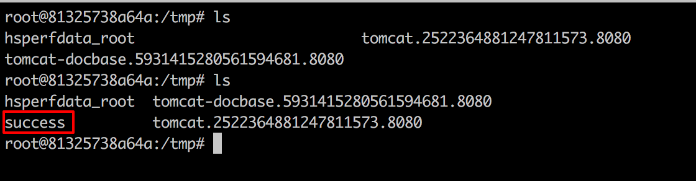

# Spring Messaging 远程命令执行漏洞（CVE-2018-1270）

spring messaging为spring框架提供消息支持，其上层协议是STOMP，底层通信基于SockJS，

在spring messaging中，其允许客户端订阅消息，并使用selector过滤消息。selector用SpEL表达式编写，并使用`StandardEvaluationContext`解析，造成命令执行漏洞。

参考链接：

- https://pivotal.io/security/cve-2018-1270
- https://xz.aliyun.com/t/2252
- https://cert.360.cn/warning/detail?id=3efa573a1116c8e6eed3b47f78723f12
- https://github.com/CaledoniaProject/CVE-2018-1270

## 漏洞环境

执行如下命令启动漏洞环境：

```
docker-compose up -d
```

环境启动后，访问`http://your-ip:8080`即可看到一个Web页面。

## 漏洞复现

网上大部分文章都说spring messaging是基于websocket通信，其实不然。spring messaging是基于sockjs（可以理解为一个通信协议），而sockjs适配多种浏览器：现代浏览器中使用websocket通信，老式浏览器中使用ajax通信。

连接后端服务器的流程，可以理解为：

1. 用[STOMP协议](http://jmesnil.net/stomp-websocket/doc/)将数据组合成一个文本流
2. 用[sockjs协议](https://github.com/sockjs/sockjs-client)发送文本流，sockjs会选择一个合适的通道：websocket或xhr(http)，与后端通信

所以我们可以使用http来复现漏洞，称之为“降维打击”。

我编写了一个简单的POC脚本[exploit.py](exploit.py)（需要用python3.6执行），因为该漏洞是订阅的时候插入SpEL表达式，而对方向这个订阅发送消息时才会触发，所以我们需要指定的信息有：

1. 基础地址，在vulhub中为`http://your-ip:8080/gs-guide-websocket`
2. 待执行的SpEL表达式，如`T(java.lang.Runtime).getRuntime().exec('touch /tmp/success')`
3. 某一个订阅的地址，如vulhub中为：`/topic/greetings`
4. 如何触发这个订阅，即如何让后端向这个订阅发送消息。在vulhub中，我们向`/app/hello`发送一个包含name的json，即可触发这个事件。当然在实战中就不同了，所以这个poc并不具有通用性。

根据你自己的需求修改POC。如果是vulhub环境，你只需修改1中的url即可。

执行：



进入容器`docker-compose exec spring bash`，可见`/tmp/success`已成功创建：


