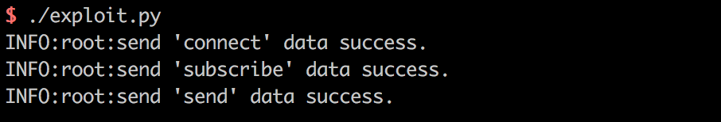
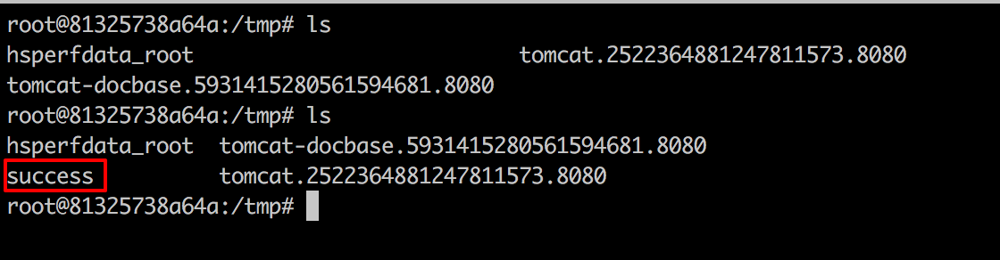

# Spring Messaging 远程命令执行漏洞（CVE-2018-1270）

spring messaging 为 spring 框架提供消息支持，其上层协议是 STOMP，底层通信基于 SockJS，

在 spring messaging 中，其允许客户端订阅消息，并使用 selector 过滤消息。selector 用 SpEL 表达式编写，并使用 `StandardEvaluationContext` 解析，造成命令执行漏洞。

参考链接：

- https://pivotal.io/security/cve-2018-1270
- https://xz.aliyun.com/t/2252
- https://cert.360.cn/warning/detail?id=3efa573a1116c8e6eed3b47f78723f12
- https://github.com/CaledoniaProject/CVE-2018-1270

## 漏洞环境

执行如下命令启动一个基于 Spring Messaging 5.0.4 的 Web 应用：

```
docker compose up -d
```

环境启动后，访问 `http://your-ip:8080` 即可看到一个 Web 页面。

## 漏洞复现

网上大部分文章都说 spring messaging 是基于 websocket 通信，其实不然。spring messaging 是基于 sockjs（可以理解为一个通信协议），而 sockjs 适配多种浏览器：现代浏览器中使用 websocket 通信，老式浏览器中使用 ajax 通信。

连接后端服务器的流程，可以理解为：

1. 用 [STOMP 协议](http://jmesnil.net/stomp-websocket/doc/) 将数据组合成一个文本流
2. 用 [sockjs 协议](https://github.com/sockjs/sockjs-client) 发送文本流，sockjs 会选择一个合适的通道：websocket 或 xhr(http)，与后端通信

所以我们可以使用 http 来复现漏洞，称之为"降维打击"。

我编写了一个简单的 POC 脚本 [exploit.py](exploit.py)（需要用 python3.6 执行），因为该漏洞是订阅的时候插入 SpEL 表达式，而对方向这个订阅发送消息时才会触发，所以我们需要指定的信息有：

1. 基础地址，在 vulhub 中为 `http://your-ip:8080/gs-guide-websocket`
2. 待执行的 SpEL 表达式，如 `T(java.lang.Runtime).getRuntime().exec('touch /tmp/success')`
3. 某一个订阅的地址，如 vulhub 中为：`/topic/greetings`
4. 如何触发这个订阅，即如何让后端向这个订阅发送消息。在 vulhub 中，我们向 `/app/hello` 发送一个包含 name 的 json，即可触发这个事件。当然在实战中就不同了，所以这个 poc 并不具有通用性。

根据你自己的需求修改 POC。如果是 vulhub 环境，你只需修改 1 中的 url 即可。

执行：



进入容器 `docker compose exec spring bash`，可见 `/tmp/success` 已成功创建：


