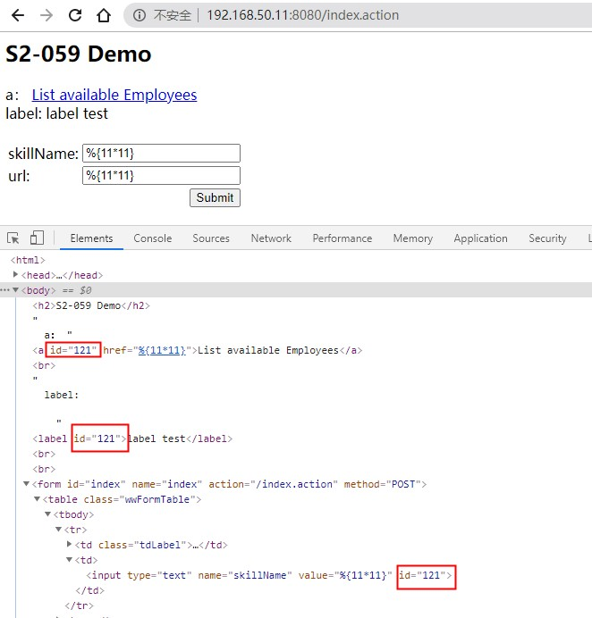

# S2-059 远程代码执行漏洞

影响版本: Struts 2.0.0 - Struts 2.5.20

漏洞详情: 

 - https://cwiki.apache.org/confluence/display/WW/S2-059
- https://www.cnblogs.com/ph4nt0mer/p/13512599.html
- https://mp.weixin.qq.com/s/VyLiLrUV0yakh_lzTBYGyQ
- https://github.com/xinhaiyucheng/Struts2-Vuln-Demo/tree/master/s2-059

## 漏洞环境

```
docker-compose up -d
```

## 漏洞原理

Struts2 会对某些标签属性（比如`id`，其他属性有待寻找）的属性值进行二次表达式解析，因此当这些标签属性中使用了 %{x} 且 x 的值用户可控时，用户再传入一个 %{payload} 即可造成OGNL表达式执行。（引用自：[Struts2 S2-059 漏洞分析](https://mp.weixin.qq.com/s/VyLiLrUV0yakh_lzTBYGyQ)）

受影响的标签有很多，这里列举三个，分别是`<a>`、`<label>`、`<input>`（参考官方demo改写）：

```jsp
  a标签： <s:url var="url" action="index"/><s:a id="%{skillName}" href="%{url}">List available Employees</s:a><br/>
  label标签:  <s:label id="%{skillName}" value="label test"/><br/><br/>

  <s:form action="index" method="POST">
    <s:textfield name="skillName" label="skillName" id="%{skillName}"/>
    <s:textfield name="url" label="url" id="%{url}"/>
    <s:submit value="Submit"/>
  </s:form>
```

## 漏洞复现

测试OGNL表达式`%{11*11}`，提交后`<a>`、`<label>`、`<input>`标签的id属性均被计算，可见OGNL表达式执行成功。



