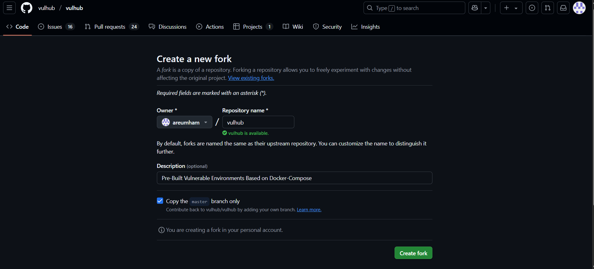
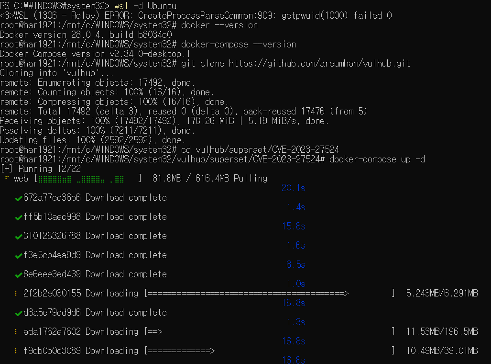
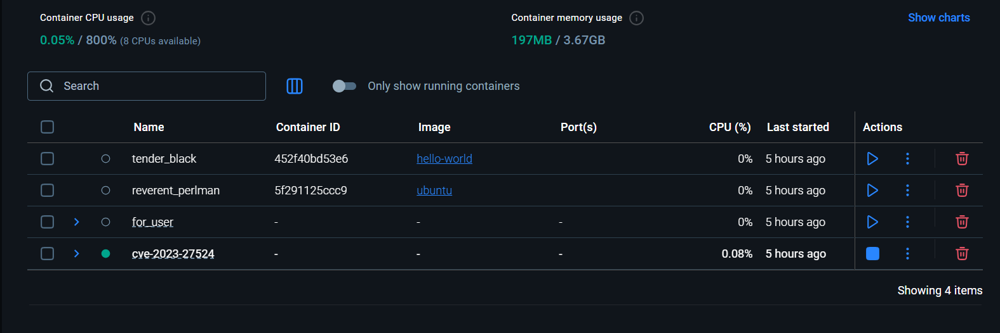
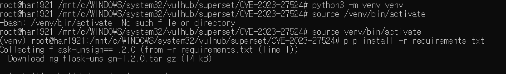
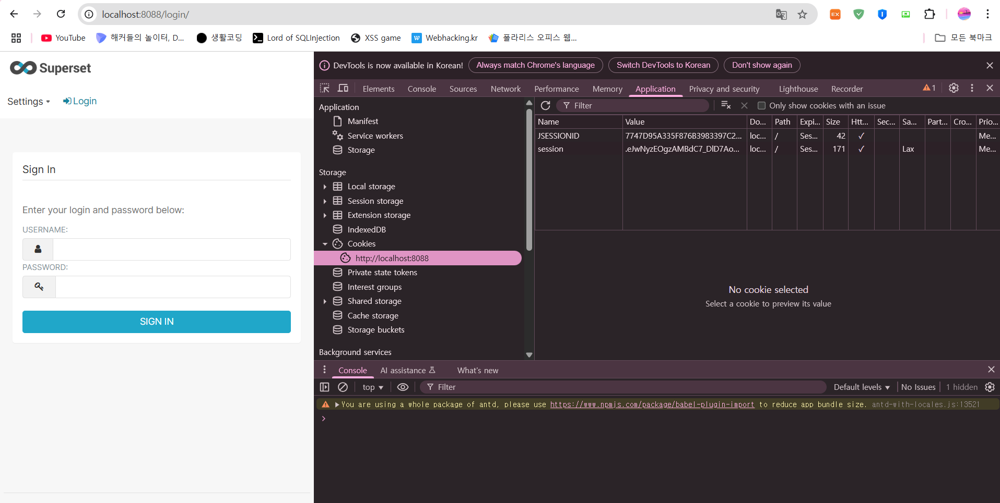

# CVE-2023-27524 취약점 분석 및 실습 보고서

1. 개요
2. 실습 환경 구성
3. 환경 설정
4. 취약점 개요 및 공격 흐름
5. 결론


1. 개요
Apache Superset은 시각적이고 대화형으로 설계된 오픈 소스 데이터 탐색 및 시각화 플랫폼이다. 본 보고서에서 다루는 CVE-2023-27524는 superset에  하드코딩된 JWT 비밀 키(CVE-2023-27524)로 인해 발생하는 인증 우회 취약점이다.이 취약점은 superset이 기본 키를 변경하지 않은 채 운영될 경우, 공격자가 유효한 세션 쿠기를 위조하여 관리자 권한을 탈취할 수 있는 문제이다. 이를 통해 대시보드 및 연결된 데이터베이스에 무단 접근할 수 있으며, 심각한 경우 원격 코드 실행(RCE)로 이어질 수 있다.
또한, 해당 취약점은 CVE-2023-37941과 결합될 경우 역직렬화 취약점을 통한 원격 코드 실행이 가능해지는 등, 공격의 위협이 증대된다.

🔗 출처:

https://nvd.nist.gov/vuln/detail/CVE-2023-27524

https://github.com/vulhub/vulhub/tree/master/superset/CVE-2023-27524

2. 실습환경 구성
- CVE 번호 : CVE-2023-27524
- 대상 애플리케이션 : Apache Superset
- 실습 목적 : CVE 환경을 Docker로 구성하고, 인증 우회 취약점 PoC를 실행하여  관리자 세션 탈취 과정을 검증한다.
- 도구 및 버전
    - OS : Ubuntu 20.04 (WSL2 사용)
    - Docker version : 28.0.4
    - docker-compose version : 2.34
    


2. 환경 설정

2-1 vulhub Fork
링크 : https://github.com/gunh0/kr-vulhub


vulhub 레포지토리를 자신의 GitHub 계정으로 Fork한 후, 해당 레포지토리에서 작업을 진행하였다.

2-2 docker wsl과 연결
wsl과 연결해주고, 취약한 Apache Superset 이미지를 실행시켜준다.
cd vulhub/superset/CVE-2023-27524
docker-compose up -d
를 실행해준다.


docker desktop과 잘 연결됨을 볼 수 있다.

2-3 컨테이너 및 포트 확인
Docker Desktop 컨테이너가 정상 실행되었는지 확인하고, 브라우저로 접속한다.


브라우저에 접속하기 위해 포트번호를 확인하고 접속한다.
필자의 포트는 8088로 http://127.0.0.1:8080로 접속한다

접속이 완료됨을 보여준다.
이것이 뜻하는 바는 세션 쿠키를 위조하여 Superset에 로그인하는 과정은, 해당 취약점이 인증 우회 가능하다는 것을 보여준다. 별도의 사용자 계정 없이도 접근이 가능하다는 점에서 위험성을 보인다.

2-4 CVE-2023-27524 PoC 실행

이를 위해 
# Install dependencies
pip install -r requirements.txt

# Forge an administrative session (whose user_id is 1) cookie
python CVE-2023-27524.py --url http://your-ip:8088 --id 1 --validate

실행해준다.

위에 이 명령어를 실행해줬을 때, 에러가 나와 가상환경을 만들어 다시 실행해주었다.


실행한 결과 

세션을 얻을 수 있었다.

이제 이결 활용하여 브라우저 로그인 쿠키를 바꿔 로그인을 시도해볼것이다.
먼저 브라우저에 접속하여 개발자 도구 -> application에 들어가준다.
밑에 주소를 클릭하면 session 값이 지정되어있음을 알 수 있다.


session값에 아까 얻은 세션값으로 대체해준다.


대체하고 새로고침을 해주면 로그인이 되었음을 확인할 수 있다.


5. 결론
VE-2023-27524는 기본 설정 그대로 운영 중인 Apache Superset 환경에서 인증 우회를 가능하게 하는 치명적인 취약점입니다. 실습을 통해 관리자 세션을 탈취하고 실제로 인증되지 않은 상태에서 시스템에 접근할 수 있음을 검증하였다.  
해당 취약점을 방지하기 위해서는 Superset 설정 시 반드시 SECRET_KEY를 강력한 랜덤 값으로 변경해야 하며, 외부에서 접근 가능한 환경에 대해서는 보안 구성(방화벽, 접근 제어 등)도 반드시 병행해야한다.


=======
<!-- markdownlint-disable first-line-heading -->
<p align="center">
  <a href="https://vulhub.org" target="_blank"></a>
</p>

<p align="center">
  <a href="https://discord.gg/bQCpZEK" target="_blank"></a>
  <a href="https://github.com/sponsors/phith0n" target="_blank"></a>
  <a href="https://vulhub.org/environments" target="_blank"></a>
  
  <a href="https://github.com/vulhub/vulhub/graphs/contributors" target="_blank"></a>
  <a href="https://github.com/vulhub/vulhub/blob/master/LICENSE" target="_blank"></a>
</p>

Vulhub is an open-source collection of pre-built, ready-to-use vulnerable Docker environments. With just one command you can launch a vulnerable environment for security research, learning, or demonstration, no prior Docker experience required.

[中文版本(Chinese version)](README.zh-cn.md)

## Quick Start

**Install Docker** (example for Ubuntu 24.04):

```bash
# Install the latest version docker
curl -s https://get.docker.com/ | sh

# Run docker service
systemctl start docker
```

For other operating systems, see the [Docker documentation](https://docs.docker.com/).

Although all Vulhub environments are running based on Docker Compose, you no longer need to install docker-compose separately. Instead, you can use the built-in `docker compose` command to start Vulhub environments.

**Download and set up Vulhub:**

```bash
git clone --depth 1 https://github.com/vulhub/vulhub
```

**Launch a vulnerable environment:**

```bash
cd vulhub/langflow/CVE-2025-3248  # Example: enter a vulnerability directory
docker compose up -d
```

Each environment directory contains a detailed **README** with reproduction steps and usage instructions.

**Clean up after testing:**

```bash
docker compose down -v
```

> [!NOTE]
>
> - Use a VPS or VM with at least 1GB RAM for best results
> - The `your-ip` in documentation refers to your host/VPS IP, not the Docker container IP
> - Ensure Docker has permission to access all files in the current directory to avoid permission errors
> - Vulhub currently supports only x86 architectures (not ARM)
> - **All environments are for testing and educational purposes only. Do not use in production!**

## Contributing

If you encounter errors during build or runtime, please first check if they are caused by Docker or related dependencies. If you confirm an issue with a Dockerfile or Vulhub code, submit an issue. See [FAQ](https://vulhub.org/documentation/faq) for troubleshooting tips.

For questions, contact us:

- [Discord](https://discord.gg/bQCpZEK)
- [Twitter](https://twitter.com/vulhub)

Thanks to all [contributors](contributors.md):

[](https://github.com/vulhub/vulhub/graphs/contributors)

## Partners

Our partners and users:

<p>
  <a href="https://www.wangan.com/vulhub" target="_blank"></a>
  <a href="https://www.cvebase.com" target="_blank"></a>
  <a href="https://www.huoxian.cn" target="_blank"></a>
  <a href="https://www.chaitin.cn" target="_blank"></a>
  <a href="https://xz.aliyun.com/" target="_blank"></a>
</p>

Sponsor Vulhub on [GitHub Sponsor](https://github.com/sponsors/phith0n), [OpenCollective](https://opencollective.com/vulhub#backer), or [Patreon](https://www.patreon.com/bePatron?u=12677520) 🙏

<p>
  <a href="https://github.com/sponsors/phith0n"></a>
  <a href="https://github.com/sponsors/phith0n"></a>
</p>

More ways to [donate](https://vulhub.org/).

## License

Vulhub is licensed under the MIT License. See [LICENSE](LICENSE) for details.
>>>>>>> 1c49e194a6eca46e8f87a74229d19d893b6568e0
