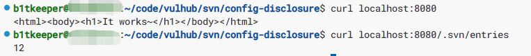

# SVN information disclosure vulnerability

SVN (subversion) is a common version control software. When using svn checkout to pull code, the `.svn/` directory is kept in the environment to save the information about the repository being referred to.

Some web code is deployed using svn checkout, so you can use the configuration file under `.svn/` to restore all source code and cause a source code leak.

Reference links:

- <https://www.zaproxy.org/docs/alerts/42/>

## Environment build

Start a web application containing an svn disclosure vulnerability by executing the following command:

```
docker compose up -d
```

After the environment is started, visit ``http://your-ip:8080`` to view the home page.

## Vulnerability recurrence

Directly request the svn configuration file and see if it returns the contents of the file
```
curl http://your-ip:8080/.svn/entries
```


